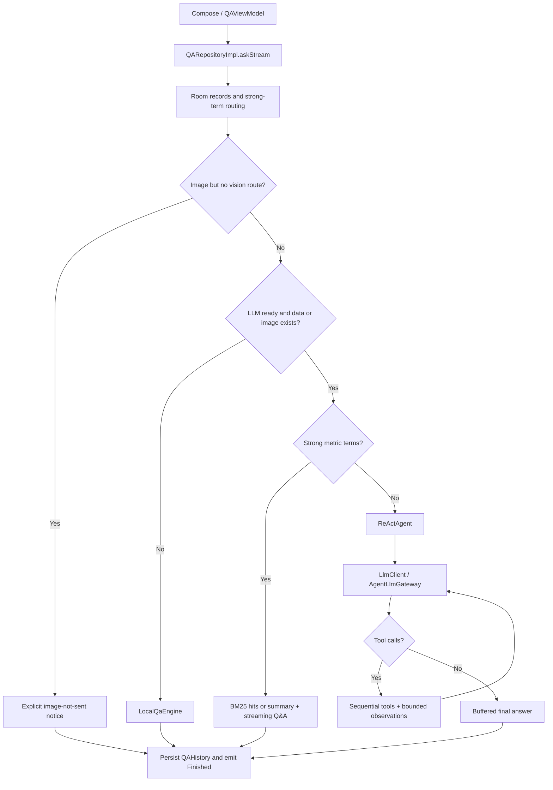

# HomeHealth Agent 岗位面试准备指南 / Agent Engineering Interview Guide

分析日期 / Analysis date: 2026-09-27  
范围 / Scope: 当前工作目录的源码，包括已有未提交修改 / Current working-tree source, including existing uncommitted changes.  
题量 / Question count: **三组各 25 题，共 75 题 / Three sets of 25 questions, 75 total.**

## 阅读约定 / Reading Conventions

**中文：** 按中高级 Agent 应用工程师岗位准备，兼顾 Android 客户端工程能力，不假定你训练过基础模型或运营过大规模 Agent 平台。原请求先说两组，随后明确增加第三组，因此三组都完整提供。每题的中文和英文覆盖相同的核心内容；先用“简答”练习 45–90 秒回答，再用分析部分应对深入追问。

**English:** This guide targets a mid-to-senior Agent application engineer, with Android engineering as the project's supporting specialty. It does not assume foundation-model training or large-scale platform operations experience. The request initially mentions two sets and then explicitly adds a third; all three are included. Practice each model answer in 45–90 seconds, then use the analysis to extend it under follow-up questioning.

**证据规则 / Evidence rules:**

- **现状 / Implemented:** 可由本次读取的代码支持；引用 `[Sxx]` 指向文末源码索引。 / Supported by inspected code; `[Sxx]` references resolve in the source index.
- **局限 / Limitation:** 静态分析发现的边界或缺口，不冒充已复现的线上事故。 / A boundary or gap found by inspection, not a claimed production incident.
- **建议 / Proposed:** 面试中的改进设计，当前仓库未必实现。 / An interview design proposal, not necessarily implemented here.
- **通用 / General:** 第三组是可迁移知识；连接到本项目的部分会明确说明。 / Set 3 covers transferable knowledge and explicitly identifies project connections.
- 此处讨论健康规则的工程实现，不验证临床有效性；不把硬编码阈值称为医学诊断。 / Health rules are discussed as software behavior, not as validated clinical diagnosis.

## 项目速记 / Project Brief

**中文：** HomeHealth 是本地优先的 Android 家庭健康管理应用。报告图片经视觉模型提取、字段及单位归一化、人工确认后写入 Room。问答按强指标词分流：具体指标通常走 BM25 检索与一次流式问答；泛化问题在配置及数据条件满足时走 ReAct；无配置或失败时有本地规则兜底。异常告警由确定性用例生成，Agent 只读取已生成告警。

**English:** HomeHealth is a local-first Android family health application. Vision extraction, field/unit normalization, and human confirmation precede persistence in Room. Questions with strong metric terms usually use BM25 retrieval and one streamed model response. Broader questions use ReAct when configuration and data conditions permit; an offline rule engine provides fallback. A deterministic use case generates alerts; the agent reads existing alerts.

| 项目事实 / Project Fact | 当前证据 / Current Evidence |
| --- | --- |
| 语言及构建 / Language and build | Kotlin；Compose compiler plugin 2.3.21；AGP 9.3.0；KSP 2.3.6；Java source/target 17。[S01] |
| Android 范围 / Android scope | minSdk 26，targetSdk 36，compileSdk 37；这些是仓库配置，不是对最新商店政策的声明。 / Repository settings, not a claim about current store policy. [S01] |
| UI 与依赖注入 / UI and DI | Jetpack Compose、ViewModel、StateFlow、Hilt；单个 Gradle app 模块。 / One Gradle application module. [S01] [S14] [S28] |
| 数据及网络 / Data and network | Room 2.8.5，数据库 v9；OkHttp 4.12.0，Gson 2.10.1；无项目自建云后端。 / No project-owned cloud backend in this codebase. [S01] [S20] [S29] |
| Agent / Agent | 一个进程内的单 Agent；自写循环；四个工具；逐个执行。 / One in-process agent, a hand-written loop, four tools, sequential execution. [S03] [S05] |
| 工具 / Tools | `search_records`、`get_reference_range`、`get_alerts`、`read_report_image`。[S06] [S07] [S08] [S09] |
| 检索 / Retrieval | 内存 BM25；默认 Top-12；中文单字及双字、拉丁字母数字切词；无 embedding 数据库。 / In-memory BM25 with no embedding database. [S13] |
| 执行预算 / Execution budgets | 最多 5 个主循环 LLM 轮次、8 次计数额度内的工具尝试、同工具连续失败 2 次禁用；观测正文保留前 1,500 字符再加省略提示；本地工具 10 秒、视觉工具 60 秒。 / Limits apply at different layers. [S03] [S04] |
| 历史和记忆 / History and memory | QAHistory 持久化用于展示；每次 Agent 重新建 entries，未加载旧问答作为上下文。 / Saved history is displayed but not replayed into new agent runs. [S02] [S03] [S15] |
| 观测 / Observability | 本地调用日志包含耗时、字符数、attempts、错误类别；不是精确 token/费用或完整 Agent trace。 / Call-level metadata, not exact token/cost accounting or full traces. [S12] [S23] |

### 真实控制流 / Actual Control Flow

中文：循环异常交给仓库降级；快路径已有正文时保留正文并提示中断。图中的回环仍受轮数和调用预算限制。 / English: Loop failures fall back at repository level. The fast path retains partial answer text with an interruption notice. The diagram's loop is bounded by turn and tool budgets.

### 不要过度宣称 / Claims to Avoid

中文：不要声称已有多 Agent、向量数据库、长期对话记忆、精确 token 计费、逐条引用校验、数据库全盘加密或完整防注入机制。API Key 加密失败时设置层会回退明文，也不能宣称所有情况下都加密保存。不要把“最后一轮不声明工具”说成绝对阻止执行，把“图像放进工具”说成保证只调用一次，把协程取消处理说成已经验证即时中断阻塞 socket。

English: Do not claim implemented multi-agent orchestration, a vector database, long-term conversational recall, exact token accounting, citation validation, full database encryption, or comprehensive injection prevention. Settings fall back to plaintext API-key storage on encryption failure, so encryption is not unconditional. Omitting tools in the last request is not a complete execution authorization check; using an image tool does not guarantee one invocation; cancellation hooks alone do not prove immediate interruption of blocking socket reads.

## 第一组：项目 Agent 实现 / Set 1: Project-Specific Agent Engineering

### A01. 如何在两分钟内解释整体 Agent 架构？ / How would you explain the agent architecture in two minutes?

**简答 / Model answer**  
中文：UI 经 QAViewModel 调用 QARepositoryImpl，仓库负责检索、路由、降级和历史落库。ReActAgent 管循环及执行预算，LlmClient 适配协议和网络，HealthToolRegistry 提供四个工具；AgentLlmGateway 让循环可以用假模型测试。  
English: QAViewModel calls QARepositoryImpl, which owns retrieval, routing, fallback, and persistence. ReActAgent owns the loop and execution limits; LlmClient handles protocols and transport; HealthToolRegistry supplies four tools. AgentLlmGateway makes loop behavior testable with scripted model responses.

**考察意图 / Why asked:** 中文：检验是否理解实际调用链和职责归属。 English: Tests whether you can trace real execution and explain ownership.

**关键要点 / Strong answer:** 中文：按一次提问串联各层；区分 UI 事件、模型回合、工具结果、数据库事实；承认 domain 接口仍引用 Room entity，并非严格隔离的 Clean Architecture。 English: Follow one question end to end; distinguish UI events, model turns, tool results, and stored facts; acknowledge that domain interfaces still reference persistence entities.

**追问 / Follow-ups:** 中文：哪里决定降级？替换模型供应商要改哪层？ English: Who decides fallback? Which layer changes for a new provider?

**常见错误 / Common mistakes:** 中文：只说 MVVM；把所有工作都归到大模型；把包分层说成多个部署服务。 English: Naming MVVM without tracing behavior, attributing everything to the model, or treating packages as deployed services.

**依据 / Evidence:** [S02] [S03] [S05] [S10] [S12] [S28]。

### A02. 为什么不是所有问题都进入 Agent？ / Why does every question not enter the agent loop?

**简答 / Model answer**  
中文：强指标词命中时，仓库优先用 BM25 与单次流式问答；无强词、LLM 就绪且有记录或图片时才考虑 Agent，同时排除有图却无视觉模型的情况。这是成本和延迟取舍，不是完整的语义复杂度分类器。  
English: Strong metric terms select BM25 plus a single streamed answer. The agent is considered for questions without strong terms when the model is ready and records or an image exist, excluding an unusable vision route. This is a cost/latency heuristic, not a semantic complexity classifier.

**考察意图 / Why asked:** 中文：判断是否知道何时不用 Agent。 English: Tests when you choose simpler execution.

**关键要点 / Strong answer:** 中文：举“血糖多少”和“整体如何”两类输入；复杂跨指标问题也可能含强词而走快路；用路由准确率、质量及调用成本验证收益。 English: Contrast a metric lookup with an overall review; a complex cross-metric question can still take the fast path; evaluate routing quality alongside answer quality and cost.

**追问 / Follow-ups:** 中文：参考范围问题但没有记录怎么办？什么时候加语义路由？ English: What happens to a reference-range question without records? When would semantic routing help?

**常见错误 / Common mistakes:** 中文：声称路由能识别推理难度；把有强词等同于检索必命中。 English: Claiming complexity detection or assuming strong terms guarantee retrieved records.

**依据 / Evidence:** [S02] [S13]。

### A03. 走一遍真实的 ReAct 回合。 / Walk through an actual ReAct turn sequence.

**简答 / Model answer**  
中文：每次 run 新建 system、user 和概览，模型返回工具调用后写入 AssistantToolCalls，逐个执行并追加 ToolResults，再请求下一轮。无工具调用时把缓冲的正文作为最终回答；例如先查询记录和已有告警，再生成带依据的解释。  
English: Each run starts with a system message, the user question, and a record overview. Tool requests become AssistantToolCalls, execute sequentially, and return as ToolResults for the next turn. A turn without tool calls commits its buffered text as the answer, for example after retrieving records and existing alerts.

**考察意图 / Why asked:** 中文：区分真实闭环与一次生成多个函数名。 English: Distinguishes an observation-driven loop from one-shot function prediction.

**关键要点 / Strong answer:** 中文：工具结果会改变下一轮决策；call ID 与结果配对；最终答案来自 onDelta 缓冲，假网关必须遵守回调契约，不能只填返回对象 text。 English: Observations affect later decisions; preserve call/result IDs; final text comes from the delta buffer, so fake gateways must honor callbacks as well as return values.

**追问 / Follow-ups:** 中文：工具结果为空如何继续？模型第五轮仍要工具怎么办？ English: How do empty results affect the next turn? What if the fifth turn still requests tools?

**常见错误 / Common mistakes:** 中文：认为每轮都有最终答案；把模型建议的调用直接等同于执行。 English: Treating intermediate text as final or equating a requested call with an executed action.

**依据 / Evidence:** [S03] [S10] [S30]。

### A04. 为什么手写循环而没有使用 Agent 框架？ / Why use a hand-written loop instead of an agent framework?

**简答 / Model answer**  
中文：当前是手机内单循环、少量工具，显式状态及预算让行为容易检查和测试。引入框架要有真实需求，例如持久化恢复、复杂分支或分布式调度；手写的代价是自己承担协议演进和边界处理。  
English: This is one mobile-process loop with a small tool set. Explicit state and budgets keep behavior inspectable and testable. A framework becomes attractive for durable recovery, complex branching, or distributed scheduling; the custom implementation must maintain protocol compatibility and edge cases itself.

**考察意图 / Why asked:** 中文：考察工程取舍而非框架熟练度背诵。 English: Tests engineering judgment rather than framework name recognition.

**关键要点 / Strong answer:** 中文：讲部署约束、复杂度和测试接口；列出迁移触发条件；迁移时保留工具契约与轨迹回归集。 English: Discuss deployment constraints, complexity, and test boundaries; define migration triggers; preserve tool contracts and trajectory regression cases.

**追问 / Follow-ups:** 中文：框架如何支持暂停确认？如何评估抽象成本？ English: How would a framework support approval pauses? How would you measure abstraction overhead?

**常见错误 / Common mistakes:** 中文：声称框架一定慢或安全；把手写等同于生产完备。 English: Claiming frameworks are inherently slow or safe, or that custom code is automatically production-ready.

**依据 / Evidence:** [S03] [S10]。

### A05. 项目如何规划和展示推理？ / How does the project plan and expose reasoning?

**简答 / Model answer**  
中文：规划是隐式的逐轮决策，没有独立 planner、任务 DAG 或搜索树。供应商返回的 thinking 及工具轮正文进入折叠轨迹，最终答案独立展示；这些生成文本并不能证明推理正确。  
English: Planning is implicit turn-by-turn decision making, with no separate planner, task DAG, or search tree. Provider thinking output and intermediate tool-turn text feed a collapsible trace, while final answers are separate. Generated reasoning text is not proof of correctness.

**考察意图 / Why asked:** 中文：检验能否区分规划机制、解释文本和执行事实。 English: Tests whether you distinguish planning, explanations, and actual execution.

**关键要点 / Strong answer:** 中文：可审计证据应是工具、参数、数据来源和终止原因；隐式推理没有可验证的完整内部过程；长任务可增加结构化计划状态，但需评价其收益。 English: Audit tool calls, arguments, evidence, and stop reasons; displayed reasoning is not a verified internal process; add structured planning only for demonstrated long-task needs.

**追问 / Follow-ups:** 中文：怎样识别无进展循环？如何避免“看起来很会想”的错误答案？ English: How would you detect non-progress? How would you reject persuasive but incorrect answers?

**常见错误 / Common mistakes:** 中文：把 thinking 当正确性证明；声称实现了 plan-and-execute 或反思优化。 English: Treating thinking as correctness evidence or claiming an implemented planner/executor or reflection optimizer.

**依据 / Evidence:** [S03] [S10] [S14] [S31]。

### A06. 一个可靠工具契约应包含什么？ / What makes a reliable tool contract here?

**简答 / Model answer**  
中文：HealthTool 暴露名称、使用时机描述、参数 schema 和 execute；结果统一为成功标记及文本。工具还要在执行时验证、归一化及限制参数，不能只信模型遵守 schema。  
English: HealthTool exposes a name, usage-oriented description, parameter schema, and execute method, returning a success flag and text. Runtime validation, normalization, and bounds remain necessary even when a schema is supplied to the model.

**考察意图 / Why asked:** 中文：考察模型接口能否转成可维护程序接口。 English: Tests whether you can turn model output into a maintainable program interface.

**关键要点 / Strong answer:** 中文：limit 被限制到 1–20；未知类型会被过滤；search 的 schema 要求 query，但执行允许回退原问题或类型条件，存在契约不完全一致；下一步可增加错误码和结构化 evidence。 English: Search limits are clamped to 1–20; unknown types are filtered; the required query field differs from permissive execution fallbacks; typed error codes and evidence would strengthen the contract.

**追问 / Follow-ups:** 中文：必填字段缺失要纠正还是失败？如何做工具版本管理？ English: Should missing inputs be repaired or rejected? How would you version tools?

**常见错误 / Common mistakes:** 中文：将合法格式等同于业务合法；过度宽容导致查询范围意外扩大。 English: Confusing valid syntax with valid business input or silently broadening queries through excessive defaults.

**依据 / Evidence:** [S05] [S06] [S32]。

### A07. 如何防止 Agent 查询错误家庭成员？ / How is member scope protected?

**简答 / Model answer**  
中文：成员由应用选择并通过 ToolContext 绑定，模型参数没有可自由指定的 memberId；查询使用 context.member.id。这能限制本轮数据范围，但不是多租户服务器上的完整身份认证方案。  
English: The application selects the member and binds it through ToolContext; tool arguments do not expose a freely chosen memberId. Queries use context.member.id. This scopes a run's data but is not a complete server-side multi-tenant authentication system.

**考察意图 / Why asked:** 中文：考察授权是否在模型之外执行。 English: Tests whether authorization is enforced outside the model.

**关键要点 / Strong answer:** 中文：身份来自可信调用方；最小化参数控制面；当前 byName 查全注册表而非本轮声明集合，建议执行前校验 allowedTools；没有图片的读图工具仍有自身检查。 English: Bind identity in trusted code, minimize model-controlled scope, and validate execution against the current allowed-tool set; byName currently searches the full registry, while the image tool separately checks image presence.

**追问 / Follow-ups:** 中文：共享设备如何认证家庭成员？添加写工具要检查什么？ English: How would shared-device authentication work? What must a write tool check?

**常见错误 / Common mistakes:** 中文：把 prompt 中写成员名当权限控制；认为隐藏 schema 就足以拒绝调用。 English: Using a prompted member name as authorization or assuming an omitted declaration prevents execution.

**依据 / Evidence:** [S03] [S05] [S09]。

### A08. 两种模型协议如何共用一个循环？ / How does one loop support two model protocols?

**简答 / Model answer**  
中文：循环维护协议无关的 AgentEntry，AgentRequestBody 负责序列化。当前 OpenAI 兼容适配器用独立 tool 消息和 tool_call_id；Anthropic 适配器用 user 中的 tool_result、tool_use_id，并把 system 放在顶层。  
English: The loop stores protocol-neutral AgentEntry values and AgentRequestBody serializes them. The OpenAI-compatible adapter uses separate tool messages with tool_call_id; the Anthropic adapter puts tool_result blocks with tool_use_id in user messages and moves system text to a top-level field.

**考察意图 / Why asked:** 中文：检验是否掌握工具回填协议的真正差异。 English: Tests concrete knowledge of tool-result round trips.

**关键要点 / Strong answer:** 中文：同一调用必须有对应结果；schema 要作为对象序列化；最后一轮省略 tools 字段；兼容协议不是所有供应商能力完全一致的保证。 English: Match every call to a result, serialize schema objects correctly, omit tools on the final turn, and test provider capabilities independently of nominal protocol compatibility.

**追问 / Follow-ups:** 中文：一轮多个工具如何回填？当前 Anthropic 转换是否保留工具轮正文？ English: How are multiple results returned? Does the current Anthropic conversion preserve intermediate assistant text?

**常见错误 / Common mistakes:** 中文：认为改 base URL 就全兼容；把工具结果当普通用户自然语言拼接。 English: Assuming a new base URL ensures compatibility or flattening tool results into untyped conversation text.

**依据 / Evidence:** [S10]。当前 Anthropic AssistantToolCalls 分支仅生成 tool_use 块。 / That branch currently emits tool_use blocks without the stored assistant text.

### A09. 为什么流式工具参数不能边到边执行？ / Why must streamed tool arguments be assembled before execution?

**简答 / Model answer**  
中文：名称、ID 和参数可能跨多片甚至多个交错调用；ToolCallAssembler 按 index 保存元信息、用 StringBuilder 拼参数，流结束后再输出调用列表。部分参数不是可执行请求。  
English: Names, IDs, and arguments can span chunks and interleave across calls. ToolCallAssembler groups by index, stores metadata, and accumulates argument strings before producing calls at stream completion. Partial arguments are not executable requests.

**考察意图 / Why asked:** 中文：考察流协议和状态机边界。 English: Tests streaming protocol and state-machine reasoning.

**关键要点 / Strong answer:** 中文：覆盖纯工具轮、截断、错误事件及乱序分片；当前非空畸形参数不会由 assembler 修复；解析器按单行 data 假设，不是完整 SSE 实现；应验证正常终止标记。 English: Cover tool-only turns, truncation, error events, and interleaving; the assembler does not repair nonempty malformed arguments; the parser assumes single-line data and should validate clean termination.

**追问 / Follow-ups:** 中文：EOF 没有结束标记怎么办？重复 ID 怎样处理？ English: What if EOF arrives without a completion marker? How should duplicate IDs behave?

**常见错误 / Common mistakes:** 中文：见到第一片就调用；声称 Gson 解析成功就表示参数完整。 English: Executing the first fragment or treating parse success as proof of complete arguments.

**依据 / Evidence:** [S11] [S12] [S33]。

### A10. 当前预算能保证什么，不能保证什么？ / What do the current execution budgets guarantee?

**简答 / Model answer**  
中文：主循环最多 5 轮；8 次额度内的工具尝试包括未知或已禁用工具的失败尝试；同工具连续失败 2 次会禁用，成功会清零。最后一轮不声明工具，但这不等于总网络请求最多 5 次或绝不执行违规调用。  
English: The main loop has at most five turns. Its eight-attempt allowance also counts failed attempts against unknown or disabled tools; two consecutive failures disable a tool, and success resets the count. The final turn omits tool declarations, but neither total HTTP requests nor off-contract execution is bounded solely by that fact.

**考察意图 / Why asked:** 中文：检验“有护栏”和“边界精确”的差别。 English: Tests whether you can state limits precisely.

**关键要点 / Strong answer:** 中文：传输重试和视觉子调用另计；省略提示会使观测总长度略超 1,500；代码没有全局时限或 token 总预算；建议最终轮硬拒绝调用、总 deadline、重复请求检测。 English: Transport retries and vision calls add requests; truncation notices exceed the retained 1,500-character prefix; no global deadline or total token budget exists; propose hard final-turn rejection and progress checks.

**追问 / Follow-ups:** 中文：八次之后为什么还回填结果？为什么字符数不是 token？ English: Why return results after the allowance is exhausted? Why are characters not tokens?

**常见错误 / Common mistakes:** 中文：把五轮等同于五次 HTTP；把工具数上限理解成只数成功调用。 English: Equating turns with HTTP attempts or counting only successful calls.

**依据 / Evidence:** [S03] [S04] [S12]。

### A11. 网络重试和 Agent 重试有什么区别？ / How do transport retries differ from agent retries?

**简答 / Model answer**  
中文：LlmClient 对 429、5xx、IOException 做有限退避重试，问答最多 3 次尝试，解析最多 2 次；Agent 则把工具失败作为 observation，让模型决定是否换参数或工具。二者必须分别预算，避免相乘后的请求成本失控。  
English: LlmClient retries 429, 5xx, and IOExceptions with bounded backoff: up to three attempts for Q&A and two for parsing. The agent instead returns tool failures as observations so the model can change its action. These layers need separate accounting to prevent multiplicative request cost.

**考察意图 / Why asked:** 中文：区分瞬时基础设施故障与错误决策。 English: Distinguishes transient infrastructure failures from incorrect decisions.

**关键要点 / Strong answer:** 中文：当前退避为 500ms、1s 加抖动；收到正文或 thinking 后禁止流式重试；工具分片先在内部缓冲；401 不应盲重试；Anthropic temperature 400 有专门兼容重发，attempts 未必等于 HTTP 数。 English: Explain 500ms/1s jittered delays, the answer/thinking retry gate, buffered tool fragments, non-retryable authentication failures, and the extra temperature compatibility request.

**追问 / Follow-ups:** 中文：是否遵守 Retry-After？怎样避免重试风暴？ English: Is Retry-After honored? How would you prevent retry storms?

**常见错误 / Common mistakes:** 中文：所有失败都重试；将 3 次尝试说成 3 次重试；重放已展示正文。 English: Retrying every error, confusing attempts with retries, or replaying visible text.

**依据 / Evidence:** [S12] [S29]。

### A12. 用户取消后怎样停止整条链路？ / How should cancellation stop the whole request?

**简答 / Model answer**  
中文：取消应从 viewModelScope 传到 Flow、循环、工具和网络；CancellationException 不应变成本地兜底或普通错误。非流式请求用 suspendCancellableCoroutine 的取消回调调用 call.cancel；流式路径的阻塞读取和 completion hook 需要专项验证。  
English: Cancellation should propagate from viewModelScope through Flow, the loop, tools, and transport. CancellationException should not become ordinary failure or fallback. Non-streaming calls bridge cancellation through suspendCancellableCoroutine; the streaming path's blocking reads and completion hook require targeted verification.

**考察意图 / Why asked:** 中文：考察协程取消与真实资源释放是否一致。 English: Tests whether coroutine cancellation actually releases external resources.

**关键要点 / Strong answer:** 中文：普通 Job completion handler 不等于即时取消通知；阻塞 read 可能拖延完成；SearchRecordsTool/GetAlertsTool 的 runCatching 会捕获取消；建议可取消异步 I/O、显式重抛和延迟 socket 测试。 English: A normal completion handler is not an immediate cancellation callback; blocking reads may delay completion; broad runCatching in local tools can swallow cancellation; use cancellable I/O and delayed-response tests.

**追问 / Follow-ups:** 中文：关闭页面一定销毁 ViewModel 吗？withTimeout 是否能打断任意代码？ English: Does navigation always clear the ViewModel? Can withTimeout interrupt arbitrary code?

**常见错误 / Common mistakes:** 中文：说 suspend 自动非阻塞；认为取消后网络必然立即停止。 English: Assuming suspend means nonblocking or that cancelling a job instantly aborts every socket.

**依据 / Evidence:** [S03] [S06] [S07] [S09] [S12] [S14]；协作式取消参见 [Kotlin cancellation API](https://kotlinlang.org/api/kotlinx.coroutines/kotlinx-coroutines-core/kotlinx.coroutines/cancel.html)。

### A13. 什么情况下回退本地，怎样让用户知道？ / When does local fallback happen, and how is it communicated?

**简答 / Model answer**  
中文：无可用模型时走本地规则；Agent 没产出正文时也回退并标注多步分析未完成。快路径已有正文则保留并提示中断或截断；有图片却没有视觉模型时明确说明图片未发送，不假装已读图。  
English: Missing model configuration uses the local engine, and an agent run without answer text falls back with an incomplete-analysis note. The fast path preserves partial text with an interruption/truncation notice. An image without a vision route gets an explicit image-not-sent response.

**考察意图 / Why asked:** 中文：考察降级是否诚实且可用。 English: Tests whether degraded behavior is useful and honest.

**关键要点 / Strong answer:** 中文：区分空答案、网络失败、生成截断、用户取消；保留可用本地依据；图片压缩失败仍有静默按文本处理的风险，不能把 noVision 分支说成覆盖所有图片失败。 English: Distinguish empty output, failure, truncation, and cancellation; retain useful evidence; image compression failure is a separate path that can silently continue as text.

**追问 / Follow-ups:** 中文：本地引擎回答不了怎么办？降级率如何监控？ English: What if the offline engine cannot answer? How would you monitor fallback frequency?

**常见错误 / Common mistakes:** 中文：把离线回答标成模型回答；把取消算失败；清空已读内容后重来。 English: Mislabeling fallback, counting cancellation as failure, or erasing already-read output.

**依据 / Evidence:** [S02] [S12] [S34]。

### A14. 为什么使用 BM25 而不是向量检索？ / Why use BM25 rather than vector retrieval?

**简答 / Model answer**  
中文：记录以指标名、别名、数值和单位为主，关键词匹配有较强可解释性；BM25 无额外模型和 embedding 上传成本。向量检索是语义改写召回不足时的候选改进，需要用真实问题集证明增益。  
English: Records are dominated by metric names, aliases, values, and units, making lexical retrieval explainable. BM25 avoids another model and embedding-upload cost. Dense retrieval is a candidate when paraphrase recall is inadequate, but its benefit must be measured on representative questions.

**考察意图 / Why asked:** 中文：考察 RAG 选型是否由数据决定。 English: Tests whether retrieval design follows the data.

**关键要点 / Strong answer:** 中文：说明别名复用、强词门控、Top-12；承认每次问答读取全量成员语料并建内存索引；“千条适用”是设计假设，不能当已测性能结果。 English: Explain shared aliases, strong-term gating, and Top-12; acknowledge full member-corpus loading and rebuilding; small-corpus suitability is an assumption, not a benchmark result.

**追问 / Follow-ups:** 中文：怎样评估 Recall@K？“这个指标”如何检索？ English: How would you measure Recall@K? How would “that metric” resolve?

**常见错误 / Common mistakes:** 中文：把 BM25 叫 embedding；声称向量一定更好；忽略成员过滤。 English: Calling BM25 embeddings, assuming vectors always win, or omitting member filtering.

**依据 / Evidence:** [S02] [S06] [S13] [S19]。

### A15. 当前上下文预算如何工作？ / How is context bounded today?

**简答 / Model answer**  
中文：快路径最多每指标 10 条、摘要约 6,000 字符；Agent 起始只给数据概览，逐轮累积工具观测，每条正文截到 1,500 字符再附提示。它控制部分输入体积，没有完整 tokenizer 计数或对所有消息的统一上限。  
English: The fast path selects up to ten records per metric and uses an approximately 6,000-character summary budget. The agent starts with an overview and accumulates observations retaining 1,500 characters each plus a notice. These are partial bounds, not tokenizer-based limits on the full request.

**考察意图 / Why asked:** 中文：考察 context engineering 是否包括成本和信息损失。 English: Tests context engineering as both budgeting and evidence preservation.

**关键要点 / Strong answer:** 中文：工具 schema、用户问题、调用参数也占上下文；概览计数来自已截选记录，不是总历史条数；建议按记录边界压缩、保留 ID/单位/日期并预留输出空间。 English: Schemas, questions, and arguments consume context too; overview counts reflect selected records, not all history; truncate on record boundaries while retaining IDs, units, dates, and output headroom.

**追问 / Follow-ups:** 中文：重要证据位于尾部怎么办？中文字符与 token 怎么估算？ English: What if critical evidence is at the end? How would you budget multilingual tokens?

**常见错误 / Common mistakes:** 中文：把字符数当精确 token；认为有上限就不会丢关键证据。 English: Equating characters with tokens or assuming bounded input preserves all important evidence.

**依据 / Evidence:** [S02] [S03] [S04] [S12]。

### A16. 这个项目真的有长期 Agent 记忆吗？ / Does this project have long-term agent memory?

**简答 / Model answer**  
中文：有持久化健康记录和问答展示历史，但每次 run 都重新建上下文，旧 QAHistory 未进入新请求。因此“那上次那个呢”不是已实现的可靠多轮指代能力。  
English: Health records and displayed Q&A history are persistent, but each run builds a fresh context without replaying QAHistory. Reliable follow-up reference resolution, such as “what about the one we discussed earlier,” is not implemented.

**考察意图 / Why asked:** 中文：区分存储、检索记忆和实际使用的记忆。 English: Distinguishes stored data from retrieved and consumed memory.

**关键要点 / Strong answer:** 中文：工作记忆是 entries；事实存储是 Room；新增会话记忆需成员隔离、近期窗口、带出处摘要及删除机制；模型生成的判断不应直接升级为健康事实。 English: Entries are working context and Room is a fact store; proposed conversation memory needs member scope, recent turns, attributed summaries, and deletion; generated interpretations should not become medical facts automatically.

**追问 / Follow-ups:** 中文：切换成员后记忆怎么办？用户纠正旧结论如何处理？ English: How does memory behave on member switching? How are corrections propagated?

**常见错误 / Common mistakes:** 中文：有历史表就说有长期记忆；把模型上下文窗口当无限数据库。 English: Claiming memory merely because a history table exists or treating context as an unlimited database.

**依据 / Evidence:** [S02] [S03] [S14] [S15]。

### A17. 图像为什么设计为工具？是否只发送一次？ / Why is vision a tool, and is the image sent only once?

**简答 / Model answer**  
中文：Agent 主循环始终发送文本，read_report_image 把图像转换为文字 observation，避免每轮把图片随历史重发。当前没有本轮读图缓存或调用一次的硬约束，因此重复调用仍可能再次发送图片。  
English: The agent's main loop sends text; read_report_image converts an image into a textual observation, avoiding automatic image replay in every turn. There is no per-run image-result cache or one-call enforcement, so repeated tool requests can resend it.

**考察意图 / Why asked:** 中文：考察多模态成本、路由和实际控制。 English: Tests multimodal cost, routing, and enforcement.

**关键要点 / Strong answer:** 中文：视觉超时 60 秒；QA 视觉配置优先，必要时使用解析服务；图中文字是低可信输入；建议以图像哈希、focus、模型版本做受限缓存，处理 focus 变化。 English: Mention the 60-second timeout, vision routing, untrusted image text, and a scoped cache keyed by image hash, focus, and model version, with deliberate handling of changed focus.

**追问 / Follow-ups:** 中文：不同 focus 要不要重读？OCR 不确定怎样表达？ English: Should a different focus reread the image? How should uncertain extraction be expressed?

**常见错误 / Common mistakes:** 中文：说工具化保证只发一次；把“图片可发送”当成“已被模型使用”。 English: Claiming exactly one upload or equating an available vision route with actual image use.

**依据 / Evidence:** [S02] [S03] [S09] [S12]。

### A18. 数据依据能保证答案可溯源吗？ / Do displayed references guarantee grounded answers?

**简答 / Model answer**  
中文：项目提供了检索明细和提示词引用要求，但没有逐条 claim 校验。Agent 保存完整 evidence，给模型的 observation 可能已截断；每个工具返回又从 [1] 编号，跨调用容易歧义，因此不能宣称逐字一致或全局唯一引用。  
English: Retrieval details and citation instructions support grounding, but there is no claim-level validator. Agent evidence retains full results while model observations may be truncated; numbering restarts at [1] in each tool response, creating ambiguity across calls. Exact evidence parity and globally unique citations are not guaranteed.

**考察意图 / Why asked:** 中文：考察是否理解“附参考资料”和“验证证据”不同。 English: Tests the distinction between attaching sources and validating support.

**关键要点 / Strong answer:** 中文：提出 record ID 与 tool-call ID 的稳定映射；显示“实际送入模型”证据版本；验证数值、单位、日期、比较符；视觉与参考范围工具当前不在 evidence 白名单。 English: Propose stable record/call identifiers, a record of what the model actually received, and validation of values, units, dates, and comparators; image/range tool results are not currently included in the evidence whitelist.

**追问 / Follow-ups:** 中文：一句话引用多个来源如何验证？截断证据是否允许引用？ English: How do you validate multi-source claims? Can omitted evidence be cited?

**常见错误 / Common mistakes:** 中文：引用数字存在就说准确；重复整理一份不同口径的依据。 English: Treating citation markers as proof or independently rebuilding inconsistent evidence.

**依据 / Evidence:** [S02] [S03] [S06] [S07]。

### A19. 为什么异常判断放在确定性代码里？ / Why keep anomaly detection deterministic?

**简答 / Model answer**  
中文：DetectAnomaliesUseCase 实现越界、三点趋势、个人历史中位数偏离，并负责告警去重和写库。get_alerts 只查询已有结果，避免问答意外触发写操作；这提升可测试性，但不证明规则具有临床诊断能力。  
English: DetectAnomaliesUseCase implements range checks, three-point trends, personal-median deviation, deduplication, and alert writes. get_alerts only reads existing results, preventing Q&A from unexpectedly creating alerts. Determinism makes rules testable, not clinically validated.

**考察意图 / Why asked:** 中文：考察 LLM 与规则引擎的责任边界。 English: Tests responsibility boundaries between models and rule engines.

**关键要点 / Strong answer:** 中文：180 天趋势跨度、至少 5 个历史基线样本、7 天去重及严重度升级；无告警不等于健康；要求模型查告警是 prompt 约束，快路径也不强制工具调用。 English: Explain trend span, baseline sample minimum, deduplication/escalation, and stale or missing data; “use alerts” is prompted behavior and does not constrain the fast path through a mandatory tool check.

**追问 / Follow-ups:** 中文：新增记录后告警是否最新？单位不一致如何处理？ English: Are alerts fresh after a new record? How are incompatible units handled?

**常见错误 / Common mistakes:** 中文：让模型重跑带写操作的用例；把历史告警当当前状态全貌。 English: Wrapping a write-producing detector as a read tool or treating historical alerts as complete current state.

**依据 / Evidence:** [S07] [S18] [S35]。

### A20. 这套工具如何面对提示词注入？ / How should this tool system handle prompt injection?

**简答 / Model answer**  
中文：报告文字、记录备注和工具输出都可能含恶意指令，应视为数据。当前成员绑定和只读业务工具限制部分损害，但还没有完整的来源隔离、输出校验或逐调用策略网关。  
English: Report text, notes, and tool output can contain hostile instructions and must be treated as data. Bound member scope and read-only business tools limit some damage, but comprehensive provenance isolation, output validation, and a per-call policy gateway are absent.

**考察意图 / Why asked:** 中文：检验是否把安全放在可信执行层。 English: Tests whether security lives in trusted execution code.

**关键要点 / Strong answer:** 中文：输入分层及数据标注只能辅助；执行前校验 allowedTools、资源范围和外发目的地；拒绝将报告中的指令升级为授权；用恶意备注与图片文字做回归集。 English: Data labeling helps but is insufficient; enforce allowed tools, resource scope, and destinations; never promote source instructions into authorization; test malicious notes and image text.

**追问 / Follow-ups:** 中文：只读工具会有什么风险？如何检测模型被资料“带偏”？ English: What can go wrong with read-only tools? How would you detect source-driven instruction following?

**常见错误 / Common mistakes:** 中文：一句“忽略恶意指令”就宣称解决；认为只读无外发、无成本。 English: Claiming a prompt solves injection or that read-only tools imply no disclosure or cost.

**依据 / Evidence:** [S03] [S05] [S06] [S07] [S08] [S09] [S12]。

### A21. 人工确认在报告导入中起什么作用？ / What role does human confirmation play in document ingestion?

**简答 / Model answer**  
中文：视觉模型输出只是候选记录，DocumentUploadViewModel 先做 SchemaNormalizer 归一化，用户编辑确认后才保存健康记录。仓库通过事务检查成员和来源文档归属、写入记录并更新完成状态，防止部分成功。  
English: Vision output is proposed data. DocumentUploadViewModel normalizes it, and users edit and confirm before health records are saved. The repository transaction checks member/document ownership, writes records, and updates completion status atomically.

**考察意图 / Why asked:** 中文：考察概率输出进入事实库之前的控制。 English: Tests controls between probabilistic output and persistent facts.

**关键要点 / Strong answer:** 中文：格式解析、语义验证、人审、事务是不同防线；原文及归一化说明在 v9 持久化；已完成文档再次确认直接返回，属于有限幂等而非任意编辑覆盖。 English: Separate parsing, semantic validation, review, and transactions; v9 retains raw text and normalization notes; repeated confirmation of a completed document returns early rather than applying arbitrary edits.

**追问 / Follow-ups:** 中文：用户确认了错误数据怎么办？进程在解析后被杀怎么办？ English: How are confirmed mistakes corrected? What if the process dies after extraction?

**常见错误 / Common mistakes:** 中文：结构化输出自动入健康事实库；把人工确认当万能准确性保证。 English: Automatically promoting extraction to fact or treating human review as infallible.

**依据 / Evidence:** [S16] [S17] [S20]。

### A22. “本地优先”具体保护什么？ / What does “local-first” actually protect?

**简答 / Model answer**  
中文：健康记录和历史存于设备 Room；API Key 正常使用 Keystore 管理的 AES-GCM，但 SettingsPrefs 在加密失败时回退明文。用户触发模型功能会向配置供应商发送所选记录或图片；本地优先不等于永不离机或 Room 已加密。  
English: Health records and history stay in Room. API keys normally use Keystore-managed AES-GCM, but SettingsPrefs falls back to plaintext if encryption fails. User-triggered model features send selected records/images to providers; local-first does not mean no outbound data or an encrypted database.

**考察意图 / Why asked:** 中文：考察能否准确描述隐私边界。 English: Tests precise privacy and threat-model claims.

**关键要点 / Strong answer:** 中文：allowBackup=false、私有文件目录和内容最小化分别解决不同问题；日志不存 prompt，但 QAHistory 存答案及 thinking；硬件保护需检查设备能力，不能凭 Keystore 名称保证 TEE。 English: Separate backup, storage isolation, and minimization; call logs omit prompts while history stores answers/thinking; hardware-backed protection requires checking device/key properties.

**追问 / Follow-ups:** 中文：换设备如何恢复？截图、通知和导出是否暴露健康数据？ English: How would device migration work? Could screenshots, notifications, or exports expose data?

**常见错误 / Common mistakes:** 中文：宣称完全离线或防 root 万无一失；把内容日志和历史存储混为一谈。 English: Claiming full offline operation or immunity to device compromise, or conflating telemetry with history.

**依据 / Evidence:** [S02] [S21] [S22] [S23]；硬件能力边界见 [Android Keystore](https://developer.android.com/privacy-and-security/keystore?authuser=1)。

### A23. 这是多 Agent 系统吗？如何合理扩展？ / Is this multi-agent, and how could it be extended responsibly?

**简答 / Model answer**  
中文：不是。它只有一个控制循环，四个工具按顺序执行；视觉模型是受调用的能力，不是独立自主协调的 Agent。若确有独立任务，可尝试检索、证据审查等专长角色，再由一个受预算约束的协调器整合。  
English: No. It has one controller and sequential tools; the vision model is a called capability, not an independently coordinating agent. If tasks are truly separable, specialist retrieval and evidence-review roles could be coordinated under a shared budget.

**考察意图 / Why asked:** 中文：考察多 Agent 概念和是否克制增加复杂度。 English: Tests conceptual accuracy and restraint in adding orchestration.

**关键要点 / Strong answer:** 中文：先用单 Agent 做基线；统一成员授权、请求 ID、数据版本及取消；并行只处理独立读取；冲突由证据与规则裁决；衡量质量增益抵不抵延迟和成本。 English: Benchmark against one agent, share authorization/run IDs/data versions/cancellation, parallelize independent reads, resolve conflicts through evidence, and measure benefit against coordination cost.

**追问 / Follow-ups:** 中文：两个 Agent 结论相反怎么办？如何防止循环委派？ English: What if specialists disagree? How do you prevent delegation loops?

**常见错误 / Common mistakes:** 中文：多工具、多模型就称多 Agent；并发数当作质量指标。 English: Equating multiple tools/models with multiple agents or using concurrency as a quality metric.

**依据 / Evidence:** [S03] [S05] [S09]。扩展部分为建议 / Extensions are proposed.

### A24. 现有观测数据能回答哪些问题？ / What can current observability tell you?

**简答 / Model answer**  
中文：调用日志记录供应商、模型、场景、延迟、输入输出字符数、图片标记、attempts 和错误类别，并按 30 天保留策略清理。它适合看调用失败和延迟，但不能直接给出任务成功率、准确账单或全链路耗时分解。  
English: Call logs record provider, model, scene, latency, text character counts, image presence, attempts, and error class, with 30-day retention cleanup. They support failure and latency analysis, but not direct task-success scoring, exact bills, or full end-to-end timing decomposition.

**考察意图 / Why asked:** 中文：考察上线后如何定位问题。 English: Tests operational diagnosis.

**关键要点 / Strong answer:** 中文：一轮 Agent 一条调用日志，视觉读取计 PARSE；字符统计未覆盖完整 schema 及图片成本；toolNames 去重后被显示成“次数”有口径问题；建议 runId/turnId/callId、首字时延及结束原因。 English: Agent turns produce separate call logs and vision reads use PARSE; character counts omit full schemas/image costs; distinct tool names are mislabeled as call counts; propose correlated run/turn/call IDs, first-token timing, and termination reasons.

**追问 / Follow-ups:** 中文：日志写失败是否影响主流程？平均耗时为何不够？ English: Should log failure break the task? Why is mean latency insufficient?

**常见错误 / Common mistakes:** 中文：把 HTTP 成功当业务成功；为排错记录完整健康 prompt。 English: Equating request success with task success or logging full health prompts for convenience.

**依据 / Evidence:** [S02] [S03] [S12] [S23]。

### A25. 如何证明 Agent 有效，并选择下一步改进？ / How would you demonstrate quality and prioritize improvements?

**简答 / Model answer**  
中文：已有假网关循环测试、协议解析测试、检索测试和工具注册表检查，本次 JVM 测试 108 项通过。下一步应建立脱敏任务集，分别衡量路由、召回、工具选择、证据支持和最终任务成功，并优先修复错误归属与不完整证据等高影响问题。  
English: Existing tests cover scripted loop behavior, protocol parsing, retrieval, and registry contracts; all 108 JVM tests passed in this analysis. Next, build a de-identified task set measuring routing, retrieval, tool selection, evidence support, and task success, prioritizing wrong-member and incomplete-evidence risks.

**考察意图 / Why asked:** 中文：考察是否把 demo 转成可评价系统。 English: Tests the transition from demo behavior to measurable quality.

**关键要点 / Strong answer:** 中文：循环现有 7 项测试不覆盖所有护栏；补八次上限、取消、最终轮违规调用、重复引用、多成员、断流；A/B 对比快路与 Agent，用同数据快照并重复采样。 English: Seven loop tests do not cover every boundary; add allowance, cancellation, final-turn violation, citation, scope, and stream-failure cases; compare routes on identical snapshots with repeated samples.

**追问 / Follow-ups:** 中文：没有标准答案怎么评？模型升级上线门槛是什么？ English: How do you evaluate without one canonical answer? What gates a model upgrade?

**常见错误 / Common mistakes:** 中文：单测通过就说模型准确；凭一次演示宣称提升百分比。 English: Treating unit-test success as model accuracy or inventing gains from a single demo.

**依据 / Evidence:** [S30] [S32] [S33] [S36] [S37] [S38] [S39]。

## 第二组：项目相关技术 / Set 2: Other Project-Grounded Technical Topics

### B01. Kotlin 的 sealed interface、data class 和空安全如何帮助这里的设计？ / How do Kotlin sealed types, data classes, and nullability help?

**简答 / Model answer**  
中文：AgentEntry 和 AgentEvent 用 sealed interface 表达有限事件集合，when 可以做穷尽分派；data class 承载调用和状态快照。可空字段表达没有图片或 thinking，但外部反序列化仍需要验证，不能只依赖 Kotlin 类型。  
English: Sealed AgentEntry and AgentEvent types define finite variants for exhaustive handling, while data classes carry calls and state snapshots. Nullable fields express absent images or thinking, but external deserialization still requires validation beyond Kotlin's type declarations.

**考察意图 / Why asked:** 中文：考察语言特性是否服务于状态建模。 English: Tests whether language features improve state modeling.

**关键要点 / Strong answer:** 中文：增加事件需检查所有消费者；copy 是浅复制；List 只读接口不等于底层不可变；Gson 与 Java 边界不能视为编译期保证。 English: New variants affect all consumers; copy is shallow; read-only List does not guarantee an immutable backing object; Gson/Java boundaries weaken compile-time guarantees.

**追问 / Follow-ups:** 中文：什么时候用 enum？状态对象包含可变集合有什么风险？ English: When is an enum sufficient? What risks come from mutable collections inside state?

**常见错误 / Common mistakes:** 中文：把 data class 当深不可变；用多个独立布尔值表示互斥阶段。 English: Assuming deep immutability or encoding mutually exclusive stages with unrelated booleans.

**依据 / Evidence:** [S05] [S10] [S14]。

### B02. Flow 和 StateFlow 在项目中分工如何？ / How do Flow and StateFlow differ in this project?

**简答 / Model answer**  
中文：askStream 是冷 Flow，每次收集都会执行一次问答；UI 状态用 StateFlow 保存最新值，并通过 combine/stateIn 聚合。事件流需要保留顺序，而界面状态允许中间快照被合并。  
English: askStream is a cold Flow: collecting it triggers a request. StateFlow holds the latest UI state, assembled through combine/stateIn. Ordered request events and conflated UI snapshots serve different purposes.

**考察意图 / Why asked:** 中文：考察是否会误触发重复请求或丢事件。 English: Tests duplicate-work and event-loss reasoning.

**关键要点 / Strong answer:** 中文：不能在多个 UI 观察者里独立 collect 冷网络流；StateFlow 不适合作为必须逐条消费的日志；WhileSubscribed(5000) 控制共享订阅，不能直接等同于终止正在 launch 的 ask 协程。 English: Avoid multiple collectors of a cold network flow; StateFlow is not an exact event log; the five-second sharing timeout does not automatically cancel separately launched request jobs.

**追问 / Follow-ups:** 中文：何时使用 SharedFlow？进程重建后如何恢复？ English: When would SharedFlow fit? What survives process recreation?

**常见错误 / Common mistakes:** 中文：所有 Flow 都是热流；界面停止观察就认为后台网络已取消。 English: Calling every Flow hot or assuming loss of UI subscribers stops every network job.

**依据 / Evidence:** [S02] [S14] [S31]。

### B03. suspend、Dispatchers.IO 和 CPU 工作有什么区别？ / How do suspend, Dispatchers.IO, and CPU work differ?

**简答 / Model answer**  
中文：suspend 允许挂起，并不自动换线程。项目把网络和文件流程放在 IO，但 BM25 构建、图像压缩和大量字符串处理也会消耗 CPU；数据扩大后应单独分析调度与耗时。  
English: suspend permits suspension but does not automatically change threads. The project shifts network/file pipelines to IO, while BM25 indexing, image compression, and large string operations also consume CPU. Larger workloads warrant separate profiling and dispatcher decisions.

**考察意图 / Why asked:** 中文：考察协程是否被误当线程魔法。 English: Tests accurate coroutine performance reasoning.

**关键要点 / Strong answer:** 中文：flowOn 影响上游；Room suspend 查询由 Room 调度；IO 上阻塞仍占线程；大型索引可移 Default、缓存并支持取消，不必到处套 withContext。 English: flowOn changes upstream execution; Room handles suspend query scheduling; blocking IO still consumes threads; large indexing can use Default and caching without indiscriminate dispatcher switching.

**追问 / Follow-ups:** 中文：怎么识别主线程卡顿？CPU 循环如何响应取消？ English: How do you identify main-thread jank? How does a CPU loop cooperate with cancellation?

**常见错误 / Common mistakes:** 中文：suspend 就不阻塞；无限扩大 IO 并发解决一切。 English: Equating suspend with nonblocking execution or treating unlimited IO concurrency as a solution.

**依据 / Evidence:** [S02] [S03] [S12] [S13] [S24]。

### B04. QAViewModel 有哪些值得讨论的竞态？ / Which QAViewModel races are worth discussing?

**简答 / Model answer**  
中文：提问捕获当时 member，但选中成员和 historyFlow 后续可以变化；结束等待用 question 文本匹配，重复问题可能误匹配旧历史。建议保留 runId、捕获的 memberId 和 Finished 返回的 history ID，使临时状态归属明确。  
English: A request captures its member, but selection and historyFlow can change afterward. Completion waits for matching question text, which may match an older repeated question. Track a runId, captured memberId, and the history ID returned by Finished to bind transient state correctly.

**考察意图 / Why asked:** 中文：考察异步 UI 的身份与时间一致性。 English: Tests identity and temporal consistency in asynchronous UI.

**关键要点 / Strong answer:** 中文：不要把潜在界面串线说成数据库必然写错成员；loading 阻止同一 ViewModel 重复 ask，不锁住全部应用；清理在取消状态下仍需小心。 English: Separate potential display mismatch from proven wrong-member persistence; loading guards one ViewModel, not the whole app; cleanup must respect cancellation semantics.

**追问 / Follow-ups:** 中文：切成员时取消还是保留任务？如何测试重复问题？ English: Cancel or retain a run on member switching? How would you test repeated questions?

**常见错误 / Common mistakes:** 中文：用问题文本作唯一请求 ID；只测试单次点击顺利完成。 English: Using question text as request identity or testing only one successful click.

**依据 / Evidence:** [S14] [S15]。

### B05. 流式回答会导致什么 Compose 性能问题？ / What Compose performance risks come with streaming answers?

**简答 / Model answer**  
中文：每个 delta 拼接新的 String 并更新状态，长回答可能产生大量复制、重组和 Markdown 重解析；自动滚动 effect 也由文本长度变化触发。应先测量，再按短时间窗口合并 UI 更新，保留完整最终文本。  
English: Each delta creates a new answer string and state update, potentially causing repeated copying, recomposition, and Markdown parsing. Text-length changes also trigger scrolling effects. Profile first, then batch UI updates over short intervals while preserving the complete final text.

**考察意图 / Why asked:** 中文：检验对感知延迟与渲染开销的理解。 English: Tests perceived latency versus rendering overhead.

**关键要点 / Strong answer:** 中文：历史列表用稳定 id；不要错误 debounce 到流结束才展示；respect 用户上滑位置；区分网络首字延迟与帧耗时；主循环已缓冲 Agent 最终答案，快路更受此问题影响。 English: Use stable history keys, avoid debouncing away the stream, respect user scroll position, distinguish network latency from frame cost, and note that fast-path text streams more frequently than buffered agent answers.

**追问 / Follow-ups:** 中文：怎样测重组次数？后台返回前台如何补齐？ English: How would you measure recomposition? How does the UI catch up after resuming?

**常见错误 / Common mistakes:** 中文：盲目缓存所有 Composable；为了流畅丢掉 delta。 English: Caching indiscriminately or dropping deltas for smoother rendering.

**依据 / Evidence:** [S14] [S31] [S40]。

### B06. Hilt 在这里解决什么问题，不能解决什么？ / What does Hilt solve here, and what does it not solve?

**简答 / Model answer**  
中文：Hilt 提供数据库、网络客户端、仓库和工具的依赖图与生命周期，循环依赖 AgentLlmGateway/ToolProvider 而非具体实例，测试时可替换。@Singleton 只表达作用域，不保证线程安全或业务操作唯一执行。  
English: Hilt supplies scoped databases, clients, repositories, and tools. Depending on AgentLlmGateway and ToolProvider enables test substitution. @Singleton defines lifetime and sharing; it does not guarantee thread safety or exactly-once business operations.

**考察意图 / Why asked:** 中文：考察依赖注入、测试边界与生命周期。 English: Tests dependency injection, test boundaries, and lifetime reasoning.

**关键要点 / Strong answer:** 中文：区分 @Provides 与接口绑定；ApplicationContext 避免持有 Activity；单例 ReActAgent 的每轮可变状态是函数局部变量；本地接口能用普通构造器做 JVM 测试。 English: Explain providers versus interface bindings, application context lifetime, per-run local mutable state inside the singleton agent, and plain-constructor JVM tests.

**追问 / Follow-ups:** 中文：哪里会出现依赖环？为什么 VisionReader 是窄接口？ English: Where could dependency cycles arise? Why make VisionReader narrow?

**常见错误 / Common mistakes:** 中文：把 DI 容器当 service locator 随处取对象；为每个小类抽无意义接口。 English: Using DI as unrestricted service location or adding interfaces without a useful boundary.

**依据 / Evidence:** [S03] [S05] [S28] [S29]。

### B07. 健康记录为什么同时保存 value、numericValue 和 comparator？ / Why store value, numericValue, and comparator separately?

**简答 / Model answer**  
中文：value 保留展示文本，例如血压或定性结果；numericValue 提供可计算值；comparator 区分精确值与上下界。只保存 Double 会把“低于某值”误当等于边界，也表达不了复合血压。  
English: value retains display text, including compound or qualitative results; numericValue supports computation; comparator distinguishes exact values from bounds. A lone Double would misrepresent a bounded result as an exact measurement and cannot represent compound blood pressure adequately.

**考察意图 / Why asked:** 中文：检验数据模型是否保留领域语义。 English: Tests whether the model preserves domain semantics.

**关键要点 / Strong answer:** 中文：unit、recordDate、memberId、sourceDocumentId 都影响解释；member 外键级联删除；sourceDocumentId 不是该 entity 声明的外键；数值字段与文本冲突需验证。 English: Units, dates, ownership, and document provenance affect interpretation; the member relationship cascades deletes; sourceDocumentId is not declared as a foreign key here; inconsistent text/numeric values need validation.

**追问 / Follow-ups:** 中文：怎么表示“约等于”或上下区间？血压要不要拆两列？ English: How would approximate values or ranges be represented? Should blood pressure have separate fields?

**常见错误 / Common mistakes:** 中文：把所有指标强转浮点；认为字段名叫关联 ID 就自动有完整性约束。 English: Forcing every value into floating point or assuming an ID field automatically has a relational constraint.

**依据 / Evidence:** [S17] [S18] [S19]。

### B08. 每指标 Top-N 查询和索引如何配合？ / How do per-metric Top-N queries and indexes interact?

**简答 / Model answer**  
中文：HealthRecordDao 用相关子查询为每个类型选择最近 N 条，并有 memberId/type/recordDate 复合索引支持成员和指标过滤及排序。结果集受限，但扫描成本仍要看执行计划；问答还会另取全量语料建 BM25。  
English: HealthRecordDao uses a correlated subquery to select recent records per metric, with a memberId/type/recordDate index supporting filtering and ordering. A bounded result does not prove bounded query work, and Q&A separately loads the full corpus for BM25.

**考察意图 / Why asked:** 中文：考察 SQL、复杂度与“返回少就是快”的误区。 English: Tests SQL reasoning beyond result-set size.

**关键要点 / Strong answer:** 中文：解释复合索引左前缀；不是 SELECT * 的覆盖索引；同日期需稳定次序可加入 ID；源码避免依赖旧 Android SQLite 不支持的窗口函数。 English: Explain the index's left prefix, why SELECT * is not covered, deterministic tie-breaking, and the repository's compatibility reason for avoiding window functions.

**追问 / Follow-ups:** 中文：如何用 EXPLAIN QUERY PLAN？全量语料如何分页或缓存？ English: How would you use EXPLAIN QUERY PLAN? How would you cache or page the corpus?

**常见错误 / Common mistakes:** 中文：说没有 N+1 就必然最优；忽略另一路全量查询。 English: Declaring a query optimal merely because it avoids N+1 or overlooking full-corpus loading.

**依据 / Evidence:** [S02] [S19]。

### B09. 如何安全升级 Room schema？ / How do you safely evolve the Room schema?

**简答 / Model answer**  
中文：当前数据库是 v9，版本间显式迁移并导出 schema；v8→v9 给 medical_documents 增加 rawText 和 normalizationNotesJson。用迁移测试确认结构与数据保留，不能用破坏性重建掩盖升级问题。  
English: The database is version 9 with explicit migrations and exported schemas. Version 8→9 adds rawText and normalizationNotesJson to medical_documents. Validate both schema and surviving data through migration tests rather than hiding upgrade failures with destructive recreation.

**考察意图 / Why asked:** 中文：检验移动端长期数据可靠性。 English: Tests long-lived mobile data reliability.

**关键要点 / Strong answer:** 中文：SQL 常量与结构测试复用；插桩测试有 v4→v9 链及单跳；JVM 结构断言不是实际设备执行迁移；列默认值、空值、索引、外键都要匹配 Room 预期。 English: Share migration SQL with structural checks; test chains and individual hops; JVM schema assertions do not execute Android migrations; verify defaults, nullability, indexes, and foreign keys against Room expectations.

**追问 / Follow-ups:** 中文：旧版本跳升级怎么办？迁移失败如何恢复？ English: What about users skipping versions? How would you recover from migration failure?

**常见错误 / Common mistakes:** 中文：只验证新安装；README 还写旧版本就照背；只看列名不看约束。 English: Testing only fresh installs, repeating stale README versions, or checking columns without constraints.

**依据 / Evidence:** [S20] [S38] [S39]；参见 [Room migration guidance](https://developer.android.com/training/data-storage/room/migrating-db-versions)。

### B10. confirmRecords 的事务与幂等边界是什么？ / What are confirmRecords' transactional and idempotency boundaries?

**简答 / Model answer**  
中文：事务内重新取文档、验证归属、删除该来源旧记录、批量插入并更新状态，避免记录保存一半。文档已 COMPLETED 时返回，使重复确认不重复导入，但不代表网络、文件或外部日历也有同一事务。  
English: A transaction reloads the document, validates ownership, replaces prior source records, inserts the batch, and updates status atomically. Returning early for COMPLETED documents prevents duplicate confirmation imports, but network, filesystem, and calendar operations are outside that transaction.

**考察意图 / Why asked:** 中文：考察原子性、幂等和外部副作用的区别。 English: Tests atomicity versus idempotency and external side effects.

**关键要点 / Strong answer:** 中文：读当前状态防止使用过期对象；校验 memberId 和 sourceDocumentId；“替换导入”和“修改完成报告”是不同需求；并发调用需验证数据库事务行为。 English: Reload state to avoid stale objects, check both identifiers, distinguish replacement import from editing completed documents, and test concurrent confirmation behavior.

**追问 / Follow-ups:** 中文：事务提交后文件删除失败怎么办？两个确认同时进入会怎样？ English: What if file deletion fails after commit? What happens with two concurrent confirmations?

**常见错误 / Common mistakes:** 中文：加个 UUID 就说幂等；把所有操作包在超长数据库事务内。 English: Equating UUIDs with idempotency or holding a database transaction across long remote operations.

**依据 / Evidence:** [S16]。

### B11. 文件、数据库和系统日历如何保持一致？ / How do files, the database, and the system calendar stay consistent?

**简答 / Model answer**  
中文：这些资源无法共享普通 Room 事务，需要显式生命周期和补偿。项目有私有图片目录、失败后清理和孤儿附件清理；日历事件和闹钟还需按保存的标识取消或重建。  
English: These resources do not share a normal Room transaction, so they need explicit lifecycles and compensating operations. The project has private image directories, failure cleanup, and orphan-attachment cleanup; calendar events and alarms also need cancellation or reconstruction using stored identities.

**考察意图 / Why asked:** 中文：考察跨资源一致性和崩溃恢复。 English: Tests cross-resource consistency and crash recovery.

**关键要点 / Strong answer:** 中文：定义“先落文件还是先写库”的失败窗口；只删自己拥有的路径；QA 孤儿清理查询失败会默认空列表，有误删旧附件风险，建议失败即停止清理；数据库 CASCADE 不会删除文件。 English: Define write-order failure windows, restrict cleanup to owned paths, fail closed if reference loading fails, and recognize that SQL cascades do not delete files. QA cleanup currently defaults a failed reference query to an empty list, creating a deletion risk.

**追问 / Follow-ups:** 中文：如何重试补偿而不重复删除？附件正在发送时如何保护？ English: How would compensation retries work? How are in-flight attachments protected?

**常见错误 / Common mistakes:** 中文：把空查询结果和查询失败混同；认为删除行等于清空全部外部资源。 English: Treating lookup failure as an empty result or assuming row deletion removes every external resource.

**依据 / Evidence:** [S02] [S16] [S41] [S42]。

### B12. 解释 BM25 公式及本实现复杂度。 / Explain BM25 and this implementation's complexity.

**简答 / Model answer**  
中文：代码为每个查询词累加 IDF × 查询词频 × 文档词频饱和项，并按文档长度归一化，参数 k1=1.5、b=0.75。它扫描所有文档评分后全排序，不是倒排索引或堆选 Top-K。  
English: The code sums IDF times query frequency times a saturating document-term-frequency factor, normalized by document length, using k1=1.5 and b=0.75. It scores every document and fully sorts positive hits; it is not an inverted-index or heap-based Top-K implementation.

**考察意图 / Why asked:** 中文：考察算法理解和优化是否有根据。 English: Tests algorithm knowledge and evidence-based optimization.

**关键要点 / Strong answer:** 中文：设 T 为语料 token 数、N 为文档数、Q 为查询独立词数、H 为命中数；建索引约 O(T)，评分约 O(NQ)，排序 O(H log H)；可缓存 df/avgLen，用堆降到 O(H log K)，但仍有评分扫描。 English: With T corpus tokens, N documents, Q unique query terms, and H hits, indexing is about O(T), scoring O(NQ), and sorting O(H log H); cached statistics and a heap reduce specific costs, not all scanning.

**追问 / Follow-ups:** 中文：为什么高频词权重低？k1=0 或 b=0 意味什么？ English: Why downweight common terms? What do k1=0 and b=0 change?

**常见错误 / Common mistakes:** 中文：说 Top-K 就必然 O(N log K)；把相关性分数当概率。 English: Inferring heap complexity from the term Top-K or treating BM25 scores as probabilities.

**依据 / Evidence:** [S13] [S36]。

### B13. 中文切词和别名词典有什么取舍？ / What tradeoffs arise from Chinese tokenization and aliases?

**简答 / Model answer**  
中文：中文用单字和相邻双字保证“钾”等短指标与“血糖”等组合召回；拉丁字母数字串小写并分开，文档追加归一化别名。它轻量、确定，但容易产生碎片弱匹配，因此另有强指标词门控。  
English: Chinese unigrams and adjacent bigrams cover both single-character metrics and compound names. Latin/digit runs are normalized and split, and aliases are added to documents. This is lightweight and deterministic but can generate weak fragment matches, motivating the strong-term gate.

**考察意图 / Why asked:** 中文：考察检索召回与精确率的实际平衡。 English: Tests practical precision/recall tradeoffs.

**关键要点 / Strong answer:** 中文：别名共用 SchemaNormalizer，避免两套词典漂移；比较符语义也进入文档；中英文混写和长名双字片段可能误判；排序分数相同时当前结果仍受输入顺序影响，注释“不影响”不能照抄。 English: Share aliases, include comparator semantics, test mixed-language fragments, and note that score ties can retain input order despite stronger comments about order independence.

**追问 / Follow-ups:** 中文：如何支持拼写错误和口语？词典变化需要重建什么？ English: How would you support typos and paraphrases? What must be rebuilt after dictionary changes?

**常见错误 / Common mistakes:** 中文：把简单切词叫完整中文语义理解；忽视单字造成的错误召回。 English: Calling lexical splitting semantic understanding or ignoring noisy unigram matches.

**依据 / Evidence:** [S13] [S17] [S36]。

### B14. 趋势和个人中位数算法有什么边界？ / What are the boundaries of trend and personal-median detection?

**简答 / Model answer**  
中文：趋势检查最近三条严格同向、累计变化超过指标阈值且跨度不超过 180 天；基线比较最新值与其余可用历史中位数，至少五条历史。它是有限窗口规则，不是预测模型或统计显著性检验。  
English: Trend checks require three strictly monotonic readings, a metric-specific total change, and a span within 180 days. Baseline checks compare the latest reading against the median of at least five eligible prior readings. These are bounded rules, not forecasting or statistical significance tests.

**考察意图 / Why asked:** 中文：考察统计概念、时间语义与工程边界。 English: Tests statistics, time semantics, and implementation limits.

**关键要点 / Strong answer:** 中文：每指标最多读取 10 条，历史基线最多来自其余 9 条；中位数排序 O(n log n) 对此很小；排除不兼容单位及区间值；趋势跨度限制不代表资料足够新。 English: At most ten recent records are fetched, leaving up to nine prior baseline samples; sorting is trivial at that size; exclude incompatible units/bounds; a short span does not guarantee fresh data.

**追问 / Follow-ups:** 中文：同日三次采样算趋势合理吗？长期偏高能否被基线消除？ English: Are three same-day readings a useful trend? Should a personal baseline suppress persistently high values?

**常见错误 / Common mistakes:** 中文：把中位数叫平均值；把最新值放入自身基线；宣称统计置信度。 English: Confusing median with mean, including the current point in its own baseline, or claiming statistical confidence.

**依据 / Evidence:** [S18] [S35]。

### B15. 单位归一化为什么不能只改单位字符串？ / Why must unit normalization do more than rename units?

**简答 / Model answer**  
中文：改单位必须与数值换算一致，并保留比较符和来源。SchemaNormalizer 按指标查可靠系数，未知不兼容单位保留原值；但空单位会回填标准单位，这是实际假设，不能概括为从不猜单位。  
English: Unit changes must agree with numeric conversion while preserving bounds and provenance. SchemaNormalizer uses metric-specific factors and retains unknown incompatible units, but fills blank units with the metric default. That is an explicit assumption, so “never infers units” would overstate the code.

**考察意图 / Why asked:** 中文：考察数据质量和领域约束。 English: Tests data-quality and domain-constraint reasoning.

**关键要点 / Strong answer:** 中文：归一化区分别名、单位拼写、数值转换；固定两位小数可能影响小数值精度；≤/≥ 被合并到 LT/GT 会丢失边界严格性；建议保留原始值、精度和操作符。 English: Separate aliases, spelling, and conversion; two-decimal rounding can lose small values; collapsing inclusive comparators into LT/GT loses boundary semantics; retain raw values, precision, and operators.

**追问 / Follow-ups:** 中文：相同单位缩写是否总同义？测试怎么覆盖换算往返误差？ English: Are identical abbreviations always equivalent? How would conversion precision be tested?

**常见错误 / Common mistakes:** 中文：对所有指标共用换算系数；未知值强制标准化；忽略数字与文本冲突。 English: Sharing factors across unrelated metrics, forcing unknown values into standards, or ignoring text/numeric disagreement.

**依据 / Evidence:** [S17] [S18] [S37]。

### B16. 如何可靠解析模型返回的结构化记录？ / How should structured model output be parsed reliably?

**简答 / Model answer**  
中文：LlmClient 按括号、字符串和转义状态提取完整对象候选，再由 Gson 寻找 records 字段，比截取首尾花括号可靠。解析成功后仍需校验类型、日期、单位及值的一致性，不能把语法正确当记录可信。  
English: LlmClient scans balanced objects while tracking strings and escapes, then uses Gson to find a records field. This is safer than slicing between the first and last brace. Successful parsing still requires type, date, unit, and value-consistency validation.

**考察意图 / Why asked:** 中文：考察非可信输入解析与失败恢复。 English: Tests parsing of untrusted output and recovery behavior.

**关键要点 / Strong answer:** 中文：先提取再解析，避免用正则实现嵌套语法；多个候选、截断、空列表分别处理；前面未闭合候选会停止扫描，仍有局限；可用受约束输出降低格式错误但保留业务校验。 English: Separate extraction and parsing, handle multiple candidates/truncation/empty records, acknowledge that an unmatched earlier object stops scanning, and retain business validation even with constrained output.

**追问 / Follow-ups:** 中文：响应里有文本注释怎么办？模型 numeric_value 与 value 冲突怎么办？ English: What about prose before the object? What if numeric_value disagrees with value?

**常见错误 / Common mistakes:** 中文：单个正则解析所有结构；自动“修复”到改变医学含义；失败日志输出原报告。 English: Using one regex for nested data, repairing semantics silently, or logging raw reports on failure.

**依据 / Evidence:** [S12] 中的 / functions `parseRecordsJson`、`extractJsonObjects`；[S16] [S17]。

### B17. 为什么有 readTimeout 仍需要整体 deadline？ / Why is a total deadline needed when readTimeout exists?

**简答 / Model answer**  
中文：网络配置是连接 10 秒、读写各 120 秒，但分阶段超时不是完整任务时限。多轮 Agent、重试、视觉子请求和持续到来的流数据都能延长总耗时，应以一次用户任务为单位分配剩余时间。  
English: Network settings use a 10-second connect timeout and 120-second read/write timeouts, but phase limits are not an end-to-end deadline. Agent turns, retries, vision requests, and a continuously arriving stream can extend total duration, so budget remaining time per user task.

**考察意图 / Why asked:** 中文：考察网络可靠性和延迟上界。 English: Tests reliability and latency-bound reasoning.

**关键要点 / Strong answer:** 中文：使用单调时钟测时；区分首字延迟、整轮耗时、排队时间；重试前判断剩余预算；deadline 必须与真正可取消 I/O 配合。 English: Use monotonic elapsed time, distinguish first-token/turn/queue latency, check remaining time before retry, and pair deadlines with cancellable I/O.

**追问 / Follow-ups:** 中文：如何避免快到截止时再发视觉请求？连接池如何复用？ English: How do you avoid starting vision near the deadline? How is connection pooling reused?

**常见错误 / Common mistakes:** 中文：把 120 秒当任务最大时间；机械地相加当精确最坏耗时。 English: Treating 120 seconds as the total task cap or presenting a simplistic timeout sum as an exact bound.

**依据 / Evidence:** [S03] [S04] [S12] [S29]。

### B18. 大图上传怎样控制内存？ / How does image upload control memory use?

**简答 / Model answer**  
中文：FileUtils 先只读图像尺寸，按 2 的幂设置 inSampleSize，再解码、JPEG 压缩和 base64 编码，默认最大边目标 1600、质量 85。先缩再解码避免持有原始大位图，但压缩缓冲和字符串仍占内存。  
English: FileUtils reads dimensions first, selects a power-of-two inSampleSize, then decodes, JPEG-compresses, and base64-encodes, targeting a 1600-pixel maximum edge and quality 85. Downsampling before decoding avoids the full original bitmap, but byte buffers and encoded strings still consume memory.

**考察意图 / Why asked:** 中文：考察移动端资源预算与多模态成本。 English: Tests mobile resource budgeting and multimodal costs.

**关键要点 / Strong answer:** 中文：ARGB 位图粗估宽×高×4 字节；base64 约增加三分之一字节量，不等于图像 token 账单；4000 边可能降至 1000 而非精确 1600；测试旋转、坏图和细小文字。 English: Estimate bitmap bytes by dimensions, distinguish base64 expansion from image-token billing, note power-of-two undershooting, and test orientation, corrupt images, and small text legibility.

**追问 / Follow-ups:** 中文：怎样兼顾 OCR 质量与内存？多个图片并发如何限流？ English: How do you trade extraction quality against memory? How would concurrent image work be limited?

**常见错误 / Common mistakes:** 中文：先完整解码再缩放；在 UI state 长期保留多份 base64。 English: Decoding full resolution first or retaining duplicate base64 images in UI state.

**依据 / Evidence:** [S02] [S24]。

### B19. synchronizedSet 和 volatile 是否足以消除竞态？ / Are synchronizedSet and volatile sufficient to eliminate races?

**简答 / Model answer**  
中文：DocumentRepositoryImpl 用 synchronizedSet 追踪解析中的文档，volatile 时间戳做清理限频。它们保证有限的可见性或单次集合操作安全，却不能使“检查时间再更新”“读取状态再重置”自动成为原子操作。  
English: DocumentRepositoryImpl uses a synchronized set for in-flight documents and a volatile cleanup timestamp. These provide visibility or single-operation synchronization, but not atomicity for check-then-update sequences or state transitions spanning database operations.

**考察意图 / Why asked:** 中文：考察线程安全的粒度。 English: Tests synchronization granularity.

**关键要点 / Strong answer:** 中文：绘制解析启动和僵尸清理的交错顺序；可用 Mutex 保护相关临界区或数据库条件更新；进程内集合不能跨进程恢复；PROCESSING 也可能代表等待人工确认。 English: Trace parsing/cleanup interleavings; use an appropriate mutex or conditional database transition; in-memory sets cannot survive process death; PROCESSING may also cover pending confirmation.

**追问 / Follow-ups:** 中文：如何区分解析中、待确认、已中断？多个清理调用怎样去重？ English: How would you separate parsing, awaiting confirmation, and interruption? How would cleanup runs be serialized?

**常见错误 / Common mistakes:** 中文：volatile 等同于锁；给单个集合加锁就宣称整个工作流无竞态。 English: Equating volatile with a lock or claiming workflow safety from one synchronized collection.

**依据 / Evidence:** [S16]。

### B20. 为什么日常检查用 WorkManager，用药时间用 AlarmManager？ / Why use WorkManager for daily checks and AlarmManager for medication times?

**简答 / Model answer**  
中文：后台异常检测是可延后的持久任务；指定服药时刻则由 MedicationAlarmScheduler 安排下一次闹钟，触发后续约。代码检查精确闹钟权限，不可用时退化为可能延迟的提醒。  
English: Daily anomaly detection is deferrable persistent work. MedicationAlarmScheduler schedules the next medication occurrence and reschedules after firing. It checks exact-alarm availability and falls back to potentially delayed delivery when unavailable.

**考察意图 / Why asked:** 中文：考察 Android 调度语义而非仅 API 使用。 English: Tests Android scheduling semantics beyond API names.

**关键要点 / Strong answer:** 中文：系统重启、时区和时间修改要恢复；广播接收器需及时结束；闹钟身份目前基于字符串 hashCode，潜在碰撞值得用 Intent data 或稳定标识改善；不可承诺精确医疗级送达。 English: Handle reboot and clock/time-zone changes, complete receivers promptly, consider hash-based PendingIntent identity collisions, and avoid promising guaranteed exact delivery.

**追问 / Follow-ups:** 中文：权限撤销后如何更新 UI？重复广播怎样避免重复通知？ English: How does permission revocation affect UI? How would duplicate broadcasts be handled?

**常见错误 / Common mistakes:** 中文：周期 Worker 当精确闹钟；按固定 24 小时推下一天忽略时区。 English: Using periodic work as an exact alarm or treating every local day as exactly 24 hours.

**依据 / Evidence:** [S25] [S27] [S42]。

### B21. 日期和时间处理有哪些典型陷阱？ / What date and time pitfalls appear here?

**简答 / Model answer**  
中文：展示日期、相对天数、出生日期和服药时刻是不同语义。DateUtils 避免共享非线程安全的 SimpleDateFormat，用本地日期算相对天数；但 parseDate 的非宽松模式不等于保证消费完整输入。  
English: Display dates, relative days, birthdays, and medication times have different semantics. DateUtils avoids sharing mutable SimpleDateFormat instances and uses local dates for relative-day calculations. Non-lenient parsing still does not necessarily prove the entire input was consumed.

**考察意图 / Why asked:** 中文：考察时间建模与边界测试。 English: Tests time modeling and boundary testing.

**关键要点 / Strong answer:** 中文：日期型数据优先 LocalDate，事件时刻用 Instant 加时区语义；测试生日当天、闰日、午夜、夏令时、非法后缀；未来日期当前 relative 也显示 Today，属于产品取舍待确认。 English: Prefer LocalDate for dates and explicit instant/zone semantics for events; test birthdays, leap days, midnight, DST, and trailing text; future dates currently display as Today in relative formatting.

**追问 / Follow-ups:** 中文：用户旅行后服药时间跟哪一时区？如何注入时钟？ English: Which zone governs reminders during travel? How would you inject a clock?

**常见错误 / Common mistakes:** 中文：用毫秒除以 24 小时表示所有日历天数；共享单例 formatter。 English: Dividing milliseconds by 24 hours for all calendar-day logic or sharing mutable formatters.

**依据 / Evidence:** [S25] [S26] [S43]。

### B22. AES-GCM 与 Keystore 如何保护 API Key？ / How do AES-GCM and Keystore protect API keys?

**简答 / Model answer**  
中文：SecretStore 使用 Keystore 中的 AES-256 密钥，随机 IV 配合 GCM 认证加密，存储带版本前缀、IV 和密文的字符串。密钥句柄与应用数据分离，但正在运行的应用仍需取得明文 API Key 发请求。  
English: SecretStore uses a Keystore AES-256 key with a fresh IV and authenticated GCM encryption, storing a version prefix, IV, and ciphertext. Key material is separated from application files, but the running application still needs the plaintext API key when making requests.

**考察意图 / Why asked:** 中文：考察密码学机制与真实威胁模型。 English: Tests cryptographic mechanisms against an actual threat model.

**关键要点 / Strong answer:** 中文：同密钥不能重用 GCM IV；base64 只是编码；密文读取失败按未配置处理，但加密写入失败回退明文，是需要说明的安全取舍；当前不要求每次用户认证；硬件能力和进程被控制仍是额外边界。 English: Never reuse an IV with the same GCM key; base64 is encoding. Failed ciphertext reads mean unconfigured credentials, but failed encryption writes fall back to plaintext, a material security tradeoff. Per-use authentication is disabled; hardware capability and process compromise remain separate concerns.

**追问 / Follow-ups:** 中文：迁移旧明文失败怎么办？怎样轮换加密密钥？ English: What if plaintext migration fails? How would encryption-key rotation work?

**常见错误 / Common mistakes:** 中文：固定 IV；把 API Key 存入 BuildConfig；认为加密 Key 同时加密了健康数据库。 English: Fixed IVs, embedding API keys in the build, or assuming credential encryption also encrypts Room.

**依据 / Evidence:** [S21]；参见 [Android KeyInfo API](https://developer.android.com/reference/android/security/keystore/KeyInfo)。

### B23. 项目该怎样划分测试层次？ / How should testing be layered for this project?

**简答 / Model answer**  
中文：纯逻辑使用 JVM 测试，例如解析器、BM25、规则和假网关循环；Room 迁移与平台行为用设备插桩；网络重试和取消需要可控 HTTP 服务的集成测试；模型质量另用任务集评测。  
English: Use JVM tests for parsers, BM25, rules, and scripted agent loops; instrumentation for Room migrations and platform behavior; controlled HTTP integration tests for retries/cancellation; and separate task datasets for model quality.

**考察意图 / Why asked:** 中文：考察测试是否匹配故障类型。 English: Tests whether verification matches the failure mode.

**关键要点 / Strong answer:** 中文：本次 108 JVM 测试通过；插桩测试存在但本次未运行；注册表 schema 测试只证明结构，不证明供应商兼容；优先增加网络故障与成员切换回归，而非重复简单 getter 测试。 English: All 108 JVM tests passed; device tests were not run; schema tests do not prove provider compatibility; prioritize transport failures and member-switching over redundant trivial tests.

**追问 / Follow-ups:** 中文：哪些测试在 CI 每次跑？如何控制假网关与真实模型差距？ English: What runs on every CI change? How do you prevent fake gateways diverging from real providers?

**常见错误 / Common mistakes:** 中文：只看覆盖率数字；用真实网络随机性代替稳定回归；把没运行说成通过。 English: Optimizing only coverage percentage, using flaky live calls for deterministic regression, or reporting unrun tests as passed.

**依据 / Evidence:** [S30] [S32] [S33] [S36] [S37] [S38] [S39] [S43] [S44]。

### B24. 记录量扩大到十万条时如何设计？ / How would you redesign for one hundred thousand records?

**简答 / Model answer**  
中文：先测全量载入、重复建索引和排序的占比，再考虑持久索引、缓存失效、元数据过滤和按需明细加载。十万条是假设的扩展场景，当前项目没有展示这个规模的性能验证。  
English: First profile full-corpus loading, repeated indexing, and sorting, then consider persistent indexes, invalidation, metadata filters, and lazy detail loading. One hundred thousand records is a hypothetical scaling exercise, not a demonstrated project capability.

**考察意图 / Why asked:** 中文：考察从本地原型扩展的系统设计能力。 English: Tests scaling judgment from a local application baseline.

**关键要点 / Strong answer:** 中文：索引按成员隔离；以数据版本驱动缓存；FTS 或倒排索引要配套迁移；仅获取候选数据；测内存峰值和 p95，是否需要服务端取决于同步与规模需求。 English: Scope indexes by member, invalidate by data version, migrate persistent indexes deliberately, fetch only candidate details, and measure peak memory/p95 before introducing a server.

**追问 / Follow-ups:** 中文：更新记录后索引怎样一致？缓存是否会泄露成员数据？ English: How do edits invalidate indexes? Could caches leak data across members?

**常见错误 / Common mistakes:** 中文：直接引入向量库而不定位瓶颈；认为分页就能解决全语料检索。 English: Adding a vector database before identifying the bottleneck or assuming pagination alone solves retrieval.

**依据 / Evidence:** [S02] [S06] [S13] [S19]。扩展方案为建议 / Scaling design is proposed.

### B25. 用户说“AI 读错了数值”，怎样排查？ / How would you debug a report that the AI used the wrong value?

**简答 / Model answer**  
中文：先取得用户授权下的最小复现，沿原图、提取原文、归一化、确认记录、召回结果、实际模型上下文、答案引用逐段比对。每一段都要判断错误在数据、选取、解释还是展示，而不是先换模型。  
English: Build a minimally scoped reproduction with permission, then compare the image, raw extraction, normalization, confirmed records, retrieval, actual model context, and answer citations. Locate whether the error originates in data, selection, interpretation, or display before changing the model.

**考察意图 / Why asked:** 中文：考察跨层调试和事实定位。 English: Tests cross-layer debugging and evidence discipline.

**关键要点 / Strong answer:** 中文：核对 memberId、单位、比较符、日期及重复引用；v9 原文和归一化说明有助重现；metadata 日志定位故障阶段但不能重建全部 prompt；修复后加入脱敏回归样例。 English: Check member scope, units, bounds, dates, and duplicate citations; v9 provenance helps; metadata identifies stages but cannot reconstruct full prompts; add a de-identified regression case after fixing the cause.

**追问 / Follow-ups:** 中文：如何排查无法复现的问题？供应商模型更新怎么办？ English: What if the issue cannot be reproduced? What if the provider silently updates the model?

**常见错误 / Common mistakes:** 中文：看到免责声明就忽略问题；生产环境开启完整敏感内容日志；只修改 prompt 不验证数据链。 English: Dismissing errors because of disclaimers, enabling sensitive production logs, or changing prompts without tracing the data.

**依据 / Evidence:** [S02] [S12] [S16] [S17] [S20] [S23]。

## 第三组：通用 Agent 知识 / Set 3: General and Generalized Agent Knowledge

本组均为通用概念或设计建议；“项目连接”只说明可举的实例，不表示仓库已实现完整能力。 / This set covers general concepts and proposed designs. Project connections are examples, not claims of implemented platform capabilities.

### C01. 什么是 LLM Agent，和 chatbot、workflow 有何区别？ / What is an LLM agent, compared with a chatbot or workflow?

**简答 / Model answer**  
中文：Agent 根据目标、状态和环境反馈选择下一步动作，并有终止与权限边界。Chatbot 描述交互形式，workflow 描述主要由代码预先决定的控制流；系统可以同时包含聊天界面、固定流程和自主选择的局部循环。  
English: An agent selects actions from goals, state, and environmental feedback within termination and permission boundaries. A chatbot describes an interaction style; a workflow mainly follows predefined control flow. One product can combine all three.

**考察意图 / Why asked:** 中文：考察概念是否明确，能否避免把所有 LLM 应用称 Agent。 English: Tests precise terminology and architectural judgment.

**关键要点 / Strong answer:** 中文：说清观察、决策、行动、反馈；自主性是程度；业务是否受益要看任务不确定性和结果可验证性；固定流程通常更易预算与测试。 English: Explain observation, decision, action, and feedback; autonomy is a spectrum; justify it through task uncertainty and verifiable outcomes; predefined paths are usually easier to budget and test.

**追问 / Follow-ups:** 中文：单次 function call 算不算 Agent？何时不应该用 Agent？ English: Is one function call an agent? When should you avoid agentic control?

**常见错误 / Common mistakes:** 中文：定义成“能聊天的模型”；把自主性高等同于产品更好。 English: Defining it as any conversational model or assuming more autonomy is always better.

**项目连接 / Project connection:** HomeHealth 的导入是固定流程，问答含快路和局部 ReAct。概念参考 [Building Effective Agents](https://www.anthropic.com/engineering/building-effective-agents)。

### C02. 如何设计一个可控 Agent 的核心状态机？ / How would you design a controllable agent state machine?

**简答 / Model answer**  
中文：显式建模任务 ID、输入、权限、计划状态、待执行动作、工具结果、预算和终止原因；状态在决策、验证、执行、观察和结束之间转换。模型提出动作，可信运行时决定是否执行及如何持久化。  
English: Model task identity, inputs, permissions, plan state, pending actions, observations, budgets, and stop reasons explicitly. Transition through decision, validation, execution, observation, and completion. The model proposes actions; a trusted runtime authorizes execution and persistence.

**考察意图 / Why asked:** 中文：考察能否把模糊的“智能”变成可测试控制流。 English: Tests whether autonomy can be made testable.

**关键要点 / Strong answer:** 中文：列出完成、无进展、预算耗尽、取消、等待确认等终态或暂停态；事件 ID 去重；状态与展示文本分开；无工具调用可能是空响应，不应自动判任务成功。 English: Include success, non-progress, budget exhaustion, cancellation, and approval waits; deduplicate events; separate state from prose; a no-tool response may still be empty or unsuccessful.

**追问 / Follow-ups:** 中文：哪一步落 checkpoint？如何检测不合法状态转换？ English: Where are checkpoints written? How are invalid transitions rejected?

**常见错误 / Common mistakes:** 中文：只存消息数组；用最后一句文本猜执行状态。 English: Storing only messages or inferring execution state from the final sentence.

**项目连接 / Project connection:** AgentEntry/Event 是起点，但没有完整持久状态机和恢复机制。[S03] [S10]

### C03. ReAct、Plan-and-Execute 和搜索式规划如何选择？ / How do you choose ReAct, plan-and-execute, or search-based planning?

**简答 / Model answer**  
中文：ReAct 交替行动和观察，适合下一步依赖新证据；Plan-and-Execute 先给任务分解，适合可分解长任务但需要重规划；树搜索探索多个候选，只有状态可模拟、评价可用且预算足够时才值得。  
English: ReAct alternates action and observation when new evidence determines the next step. Plan-and-execute decomposes longer tasks but needs replanning. Search explores alternatives and is useful only when states can be simulated or evaluated within an acceptable budget.

**考察意图 / Why asked:** 中文：考察规划策略的条件和成本。 English: Tests planning tradeoffs and applicability.

**关键要点 / Strong answer:** 中文：比较环境不确定性、分支因子、工具代价和计划失效；预先列步骤不保证执行正确；不可逆动作不能随便探索；用同一基线衡量成功率和成本。 English: Compare uncertainty, branching factor, action cost, and plan staleness; a plan is not proof of correct execution; irreversible actions are poor exploration steps; evaluate against the same baseline.

**追问 / Follow-ups:** 中文：何时触发重规划？搜索价值函数从哪里来？ English: What triggers replanning? Where does a search value function come from?

**常见错误 / Common mistakes:** 中文：所有任务都先做长计划；认为推理越长越准确。 English: Requiring long plans for every task or assuming longer reasoning is more accurate.

**项目连接 / Project connection:** 当前实现最接近受预算限制的 ReAct，没有独立 planner。[S03] 理论来源：[ReAct paper](https://arxiv.org/abs/2210.03629)。

### C04. 怎样处理不确定性、反思和“自我纠错”？ / How should agents handle uncertainty, reflection, and self-correction?

**简答 / Model answer**  
中文：区分缺少数据、来源冲突、工具失败和模型不确定，再决定补查、澄清、限定结论或拒绝下结论。反思只有结合新证据、可验证规则或独立检查才有价值，重复让同一模型想一遍可能强化原错误。  
English: Separate missing data, conflicting sources, tool failure, and model uncertainty before choosing retrieval, clarification, qualified output, or abstention. Reflection is useful when supported by new evidence, verifiable rules, or independent checks; repetition can reinforce the original mistake.

**考察意图 / Why asked:** 中文：考察如何避免自信幻觉和无效推理循环。 English: Tests resistance to confident hallucination and unproductive loops.

**关键要点 / Strong answer:** 中文：置信度不能只靠模型自报；验证数值或引用比生成长解释更实用；反思也受预算限制；评价“正确拒答”和任务完成的平衡。 English: Do not rely solely on self-reported confidence; verify claims instead of rewarding long explanations; bound reflection; measure appropriate abstention alongside completion.

**追问 / Follow-ups:** 中文：什么情况下问用户？如何衡量置信度校准？ English: When should the agent ask the user? How would calibration be measured?

**常见错误 / Common mistakes:** 中文：多次相同答案当独立证据；把解释文本当真实完整内部推理。 English: Treating repeated answers as independent evidence or explanations as verified internal reasoning.

**项目连接 / Project connection:** 可把无记录、无告警、工具失败分成不同结果类型，避免都压成一段文本。[S05] [S06] [S07]

### C05. 如何组织提示词与上下文的信任层级？ / How should prompts and context be organized by trust?

**简答 / Model answer**  
中文：应用政策和授权状态来自可信控制面，用户请求定义任务，检索资料和工具结果提供事实而不是新增权限。使用角色、明确数据边界和来源标记辅助模型理解，同时由代码执行真正的授权。  
English: Application policy and authorization come from trusted control logic; the user request defines the task; retrieved material and tool results supply facts rather than new permissions. Roles, data boundaries, and provenance help the model, while code enforces actual authority.

**考察意图 / Why asked:** 中文：考察 prompt engineering 是否包含安全与可维护性。 English: Tests prompt engineering as trust management and maintainability.

**关键要点 / Strong answer:** 中文：写清目标、允许动作、输出要求和证据标准；避免相互冲突提示；提示模板版本化；做恶意文档和普通失败样例的回归，而非只看漂亮示例。 English: Specify goals, allowed actions, output contracts, and evidence requirements; avoid conflicting instructions; version templates and test malicious documents plus ordinary failures.

**追问 / Follow-ups:** 中文：工具返回“忽略之前规则”怎么办？如何管理超长 system prompt？ English: What if a tool says to ignore earlier rules? How do you manage an oversized system prompt?

**常见错误 / Common mistakes:** 中文：认为某种分隔符天然防注入；把 secret 写入 system 以为用户看不到就安全。 English: Treating delimiters as a security boundary or hiding secrets in prompts.

**项目连接 / Project connection:** SYSTEM_PROMPT 提供行为要求，ToolContext 提供更强的成员范围约束。[S03] [S05]

### C06. Function calling、结构化输出与执行授权有何区别？ / How do function calling, structured output, and authorization differ?

**简答 / Model answer**  
中文：Function calling 表示模型提出调用意图和参数；结构化输出约束表示形式；授权决定某身份在当前状态能否执行动作。即使输出格式严格合法，也可能请求错误资源、过大范围或未经授权的操作。  
English: Function calling expresses a proposed action and arguments; structured output constrains representation; authorization decides whether an identity may perform that action in the current state. Perfectly valid output can still request the wrong resource or an unauthorized operation.

**考察意图 / Why asked:** 中文：考察模型输出到程序执行的边界。 English: Tests the boundary from model output to execution.

**关键要点 / Strong answer:** 中文：分别验证语法、schema、业务不变量、权限和预算；输出类型要有明确错误；写动作加入幂等键和具体确认；不要静默修复有危险歧义的参数。 English: Validate syntax, schema, business invariants, authorization, and budgets separately; define typed errors; add idempotency and concrete approval for writes; avoid repairing dangerous ambiguity silently.

**追问 / Follow-ups:** 中文：何时自动补默认值？重复写调用怎么办？ English: When are defaults appropriate? How are duplicate writes handled?

**常见错误 / Common mistakes:** 中文：工具 schema 等同权限；工具返回成功就等同业务正确。 English: Equating schemas with permissions or tool success with business correctness.

**项目连接 / Project connection:** ToolArgs 的容错与 ToolContext 的身份绑定分别属于不同层次。[S05] [S06]

### C07. MCP 解决什么，不能替代什么？ / What does MCP solve, and what does it not replace?

**简答 / Model answer**  
中文：MCP 规范应用与外部能力提供方之间的上下文和工具交换，涉及 host、client、server 以及 tools/resources/prompts。它帮助互操作，不替代 Agent 规划、业务授权、效果评测或可靠执行策略。  
English: MCP standardizes context and tool exchange through hosts, clients, servers, and primitives such as tools, resources, and prompts. It improves interoperability but does not replace agent planning, business authorization, evaluation, or reliable execution policy.

**考察意图 / Why asked:** 中文：考察协议知识及抽象边界。 English: Tests protocol knowledge and abstraction boundaries.

**关键要点 / Strong answer:** 中文：区分模型端 function calling 与应用端工具协议；本地和远程传输有不同部署及鉴权约束；以实际协议版本为准；发现工具不等于信任或获准执行它。 English: Distinguish model function-calling from application/tool interoperability; local and remote transports have different operational requirements; pin protocol assumptions; discovery does not confer trust or permission.

**追问 / Follow-ups:** 中文：工具列表变更如何处理？远程工具返回敏感资料怎么限制？ English: How are changing tool lists handled? How is sensitive remote output constrained?

**常见错误 / Common mistakes:** 中文：MCP 等于多 Agent 协调；接入 MCP 就自动安全。 English: Equating MCP with multi-agent coordination or assuming integration grants safety.

**项目连接 / Project connection:** HealthToolRegistry 是本地接口，不是 MCP server/client。[S05] 概念依据：[MCP architecture](https://modelcontextprotocol.io/docs/2026-07-28/learn/architecture)。

### C08. 设计一条完整 RAG 链路需要哪些阶段？ / What stages belong in a complete RAG pipeline?

**简答 / Model answer**  
中文：包括数据采集及版本、解析、切分或记录建模、索引、权限过滤、候选召回、可选重排、上下文选择、生成和引用校验。检索返回相似内容只是中间一步，不能独自保证答案可信。  
English: A complete pipeline includes ingestion/versioning, parsing, chunk or record modeling, indexing, authorization filters, retrieval, optional reranking, context selection, generation, and citation validation. Retrieving similar material is only an intermediate step.

**考察意图 / Why asked:** 中文：考察是否掌握端到端质量链。 English: Tests end-to-end quality reasoning.

**关键要点 / Strong answer:** 中文：预过滤保护数据范围；保留源 ID、日期、单位和版本；分别评检索与生成；无证据时澄清或拒答；删除和更新需同步到索引。 English: Filter scope before exposure, retain identifiers/time/units/version, evaluate retrieval separately from generation, handle missing evidence explicitly, and propagate edits/deletes to indexes.

**追问 / Follow-ups:** 中文：召回高但答案差从哪查？重排放在哪？ English: What if retrieval is good but answers are poor? Where does reranking fit?

**常见错误 / Common mistakes:** 中文：把所有 RAG 等同向量查询；先跨用户检索再让模型自行筛选。 English: Equating RAG with vector search or relying on the model to filter other users' data.

**项目连接 / Project connection:** HomeHealth 有记录建模、BM25 和上下文构建，但没有独立重排及引用验证阶段。[S02] [S13]

### C09. 何时引入 embedding、混合召回和重排？ / When should embeddings, hybrid retrieval, and reranking be introduced?

**简答 / Model answer**  
中文：当关键词系统在同义改写、自然语言意图等分布上有明确漏召回时考虑 dense retrieval。混合召回结合词法精确匹配和语义候选，重排再按问题比较候选相关性；是否有效由评测与成本决定。  
English: Consider dense retrieval when lexical retrieval demonstrably misses paraphrases or intent-based queries. Hybrid retrieval combines exact lexical matches with semantic candidates, then reranking refines relevance. Evaluation and cost determine whether the added stages are worthwhile.

**考察意图 / Why asked:** 中文：考察 embedding 概念、检索选型及迁移成本。 English: Tests embedding concepts, retrieval selection, and migration costs.

**关键要点 / Strong answer:** 中文：embedding 是学习出的向量表示，相似度不是事实正确概率；结构化记录应保留完整值/单位/日期，不任意截断；不同模型向量空间不能混用；升级需重建索引、双读验证和隐私评估。 English: Similarity is not truth probability; keep record facts together; vectors from different models are not interchangeable; upgrades need reindexing, comparison, and privacy review.

**追问 / Follow-ups:** 中文：RRF 和加权分数怎么选？向量距离相近但单位不同怎么办？ English: When would you use rank fusion versus weighted scores? What about similar records with different units?

**常见错误 / Common mistakes:** 中文：维度越大一定越准；向量相似就能做数值比较；忽略索引版本。 English: Assuming higher dimensions guarantee quality, using similarity for numeric reasoning, or ignoring index versions.

**项目连接 / Project connection:** 当前没有 embedding；先用 QaRetrieverTest 的词法基线扩充语义改写集。[S13] [S36]

### C10. Agent 记忆有哪些类型，如何治理？ / What memory types do agents need, and how should they be governed?

**简答 / Model answer**  
中文：可区分本轮工作记忆、会话历史、事件经验、可验证事实和程序性规则；存储、检索和注入模型是不同步骤。写入长期记忆需要来源、成员或用户范围、有效期、冲突处理及删除机制。  
English: Distinguish working context, conversation history, episodic experience, verified facts, and procedural rules. Storage, retrieval, and insertion into model context are separate operations. Long-term writes need provenance, scope, validity, conflict handling, and deletion.

**考察意图 / Why asked:** 中文：考察记忆是否形成可靠知识而非污染源。 English: Tests memory as governed information rather than uncontrolled accumulation.

**关键要点 / Strong answer:** 中文：用户明确陈述与模型推断分开；更正旧记忆要可传播；敏感信息最小化；自动摘要应保留不确定性和出处；评估有用召回与错误记忆率。 English: Separate user facts from model inference, propagate corrections, minimize sensitive data, preserve uncertainty in summaries, and evaluate useful recall alongside false-memory errors.

**追问 / Follow-ups:** 中文：同名用户如何隔离？怎样删除已进入摘要的信息？ English: How are similarly named users separated? How do you remove a fact embedded in summaries?

**常见错误 / Common mistakes:** 中文：无限追加全部对话；把过去的错误答案再次作为证据。 English: Appending all history indefinitely or treating prior generated errors as evidence.

**项目连接 / Project connection:** Room 健康事实、QAHistory 与本轮 entries 可作为三种不同存储/使用角色的例子。[S02] [S03] [S15]

### C11. 上下文太长时，怎样压缩而不丢关键事实？ / How should long context be compressed without losing critical facts?

**简答 / Model answer**  
中文：先按任务相关性选择信息，再用保留来源的结构化摘要压缩，原始事实留在可检索存储中。身份、授权、数值、单位、时间、未解决问题和动作结果应优先保留，并预留工具返回和最终输出预算。  
English: Select task-relevant information before compressing it into attributed summaries, keeping original facts retrievable. Prioritize identity, authorization, values, units, timestamps, unresolved issues, and action outcomes, while reserving room for tool results and final output.

**考察意图 / Why asked:** 中文：考察 context engineering 的信息保真。 English: Tests preservation of information under context pressure.

**关键要点 / Strong answer:** 中文：tokenizer 估算优于字符硬切；完整保留工具调用与结果配对；压缩后要检验关键事实；避免把“未找到”总结成“不存在”；长上下文并不自动保证模型使用全部证据。 English: Use token estimates, retain call/result pairs, validate critical facts after compression, preserve absence-versus-missing distinctions, and do not assume every supplied fact will influence the answer.

**追问 / Follow-ups:** 中文：摘要出错怎么恢复？何时重新检索而不是继续摘要？ English: How do you recover from a bad summary? When should you retrieve again instead of compressing further?

**常见错误 / Common mistakes:** 中文：简单截尾可能删除关键结论；把摘要视为不可变真相。 English: Blind tail truncation or treating summaries as immutable truth.

**项目连接 / Project connection:** 可将当前 1,500 字符截断升级为按记录和稳定 ID 压缩的结果。[S03] [S04]

### C12. 多模态 Agent 比纯文本系统多哪些风险？ / What extra risks arise in multimodal agents?

**简答 / Model answer**  
中文：图像还涉及质量、方向、裁剪、OCR 不确定性、坐标或页码定位、成本和图中文字注入。提取与解释应分开，记录模型实际看过什么，并明确不确定或未读取的部分。  
English: Images introduce quality, orientation, cropping, extraction uncertainty, spatial/page provenance, cost, and embedded instruction risks. Separate extraction from interpretation, record what the model actually received, and identify unread or uncertain content.

**考察意图 / Why asked:** 中文：考察多模态是否只是“传一个图片参数”。 English: Tests whether multimodal design goes beyond attaching an image.

**关键要点 / Strong answer:** 中文：保留原图与派生文本对应关系；读取失败不该生成仿佛已读图的答案；图片缩放影响细节；同一图可按需求裁切，但要保留范围信息；视觉结果仍须证据校验。 English: Link source images to extracted text, prevent false claims of image use, evaluate scaling effects, retain crop provenance, and validate visual claims as evidence.

**追问 / Follow-ups:** 中文：多页报告怎么处理？两张图上的数值冲突怎么办？ English: How would multi-page reports work? How would conflicting values across images be resolved?

**常见错误 / Common mistakes:** 中文：裁掉单位还做结论；图像路径存在就记为已经分析。 English: Cropping away units or treating a stored image path as proof of analysis.

**项目连接 / Project connection:** 图片压缩、视觉路由和 imageUsed 标记是讨论实际使用状态的入口。[S02] [S09] [S24]

### C13. 什么情况下多 Agent 比单 Agent 合理？ / When is multi-agent design justified over a single agent?

**简答 / Model answer**  
中文：任务能分解成相对独立、有不同工具或上下文需求的子任务，且并行或专业分工确有收益时才考虑。多个 Agent 也增加重复检索、协调延迟、错误传播和权限面，应与强单 Agent 基线比较。  
English: Multi-agent design is justified when separable subtasks have distinct tools or context needs and parallelism or specialization provides measurable benefit. It also adds duplicate work, coordination latency, error propagation, and permission surfaces, so compare against a capable single-agent baseline.

**考察意图 / Why asked:** 中文：考察能否根据任务结构选架构。 English: Tests architecture choice from task structure.

**关键要点 / Strong answer:** 中文：对比协调者-专家、流水线和并行独立审查；输出使用明确契约及来源；共享总预算；规模小或高耦合任务不必拆分。 English: Compare supervisor/specialist, pipeline, and parallel-review patterns; require contracts and provenance; share a global budget; avoid decomposing tightly coupled small tasks.

**追问 / Follow-ups:** 中文：并行加速受什么限制？如何确定专家数量？ English: What limits parallel speedup? How would you choose the number of specialists?

**常见错误 / Common mistakes:** 中文：每个功能建一个 Agent；角色名称不同就认为错误独立。 English: Creating an agent for every function or assuming role labels create independent errors.

**项目连接 / Project connection:** 本项目的确定性异常检查不需要改成“医生 Agent”；它可继续作为受控事实来源。[S18]

### C14. 多 Agent 的共享状态与冲突怎样处理？ / How should multi-agent shared state and conflicts be handled?

**简答 / Model answer**  
中文：使用明确所有者、版本化事实和结构化交接，避免让所有 Agent 随意覆盖同一段记忆。冲突按来源权威、数据新鲜度和可验证约束处理，必要时交给人，不用多数投票替代证据。  
English: Use explicit ownership, versioned facts, and structured handoffs instead of letting every agent overwrite shared memory. Resolve conflicts through source authority, freshness, and verifiable constraints, escalating when needed rather than substituting voting for evidence.

**考察意图 / Why asked:** 中文：考察协调能否变成可靠系统。 English: Tests reliable coordination and shared-state design.

**关键要点 / Strong answer:** 中文：交接包含 task ID、成员范围、输入版本、证据和未解问题；限制委派深度与扇出；采用乐观版本检查或单写者；不同模型也可能共享同类偏差。 English: Handoffs include task/scope/version/evidence/unresolved issues; bound delegation depth and fan-out; use optimistic version checks or single-writer ownership; different models can share biases.

**追问 / Follow-ups:** 中文：迟到结果如何处理？一个专家超时是否取消全体？ English: How are late results handled? Should one specialist timeout cancel all work?

**常见错误 / Common mistakes:** 中文：共享无版本聊天记录当协调协议；相互递归委派直到预算耗尽。 English: Using an unversioned chat transcript as coordination or allowing recursive delegation without bounds.

**项目连接 / Project connection:** 若未来引入专家，先复用 ToolContext 的成员绑定，再增加 run/version 标识。[S05]

### C15. 并发工具和重试怎样避免重复副作用？ / How do concurrent tools and retries avoid duplicate side effects?

**简答 / Model answer**  
中文：只并发相互独立的操作；对写操作使用稳定幂等键、持久状态和明确提交边界。超时意味着结果未知而非必然失败，重试前应查询状态或依赖服务端去重。  
English: Parallelize only independent operations and give writes stable idempotency keys, durable state, and explicit commit boundaries. A timeout means the outcome may be unknown, not that execution necessarily failed; reconcile or rely on server-side deduplication before retrying.

**考察意图 / Why asked:** 中文：考察分布式系统基础能否应用到 Agent。 English: Tests distributed-systems reasoning in agent execution.

**关键要点 / Strong answer:** 中文：预算先原子预留再调度；取消不保证撤销已完成外部动作；区分 at-least-once 传递与幂等效果；写入结果和状态应可重放审计；限制每供应商并发。 English: Reserve budgets atomically, recognize cancellation is not rollback, distinguish delivery semantics from idempotent effects, keep replayable execution records, and limit provider concurrency.

**追问 / Follow-ups:** 中文：幂等键何时过期？部分并行任务成功后如何补偿？ English: When do keys expire? How are partially successful batches compensated?

**常见错误 / Common mistakes:** 中文：重试时生成新幂等键；声称客户端能单独保证 exactly-once 外部执行。 English: Generating a new key for each retry or claiming client logic alone guarantees exactly-once remote effects.

**项目连接 / Project connection:** 当前工具逐个执行，未来并发需要改事件关联方式，不能只靠工具名匹配 UI 结果。[S03] [S14]

### C16. 如何支持 Agent 暂停、人工批准和崩溃恢复？ / How would you support pauses, human approval, and crash recovery?

**简答 / Model answer**  
中文：在有意义的状态边界持久化 checkpoint，保存已完成动作、待确认动作、证据和剩余预算。恢复时先核对外部动作状态；批准应绑定具体动作及参数版本，过期或参数变化需重新评估。  
English: Persist checkpoints at meaningful state boundaries with completed actions, pending approvals, evidence, and remaining budget. Reconcile external effects before resuming. Approval should bind a specific action and parameter version, with expiration or changed parameters triggering reevaluation.

**考察意图 / Why asked:** 中文：考察长任务和人机协同的可靠性。 English: Tests reliability of long-running and human-in-the-loop work.

**关键要点 / Strong answer:** 中文：等待确认不应一直占住网络连接；重启后不能重新执行已提交写动作；checkpoint 需加密、访问控制、清理和版本迁移；最终历史不是执行检查点。 English: Approval waits should release active connections; resumes must not replay committed writes; checkpoints need access control, retention, and versioning; completed history is not an execution checkpoint.

**追问 / Follow-ups:** 中文：批准时数据已变怎么办？恢复旧版本流程怎么兼容？ English: What if data changes before approval? How do you resume an older workflow version?

**常见错误 / Common mistakes:** 中文：保存聊天文本就说可恢复；把一次批准当永久授权。 English: Treating saved prose as resumable execution or one approval as permanent permission.

**项目连接 / Project connection:** 报告人工确认和 PROCESSING 恢复能启发设计，但 ReAct 本身没有 durable checkpoint。[S03] [S16]

### C17. Agent 安全应在哪些层实施？ / At which layers should agent security be enforced?

**简答 / Model answer**  
中文：在身份与授权、工具执行、数据来源、网络外发、资源预算和输出展示分别实施控制。把模型视为可能提出错误动作的组件，按最小权限暴露能力，并对敏感副作用做代码校验和必要确认。  
English: Enforce controls across identity, authorization, tool execution, data provenance, outbound access, resource budgets, and presentation. Treat the model as a component that can propose incorrect actions, expose least-privilege capabilities, and validate sensitive side effects in code.

**考察意图 / Why asked:** 中文：考察是否有系统化威胁模型。 English: Tests systematic threat modeling.

**关键要点 / Strong answer:** 中文：提示注入、越权、凭证泄漏、路径遍历、恶意工具输出和拒绝服务分别建测试；沙箱限制资源但不验证业务意图；审计日志本身也要去敏；工具新增需重新评估权限。 English: Test injection, cross-scope access, secret leakage, path traversal, hostile output, and resource exhaustion separately; sandboxes do not validate intent; sanitize audit data; reassess permissions when tools change.

**追问 / Follow-ups:** 中文：如何限制远程 URL 工具？怎样处理看似合法的批量外发？ English: How would URL-fetching tools be constrained? How would apparently valid bulk exfiltration be detected?

**常见错误 / Common mistakes:** 中文：只靠 system prompt；认为只读或沙箱等于无风险。 English: Relying only on prompts or treating read-only/sandboxed execution as risk-free.

**项目连接 / Project connection:** 成员绑定是有效控制；工具声明过滤和业务只读仍需执行层校验及外发控制。[S03] [S05] [S21]

### C18. 高风险领域如何管理隐私和决策边界？ / How should privacy and decision boundaries be managed in sensitive domains?

**简答 / Model answer**  
中文：先明确系统能提供的信息服务、不能代替的专业决策，以及哪些数据可为当前任务发送给谁。通过最小化、可见来源、保留策略、删除能力和不确定性表达实现这些边界，免责声明只是辅助。  
English: Define the information service, the professional decisions it cannot replace, and which data may be sent to which recipient for the task. Enforce this through minimization, source visibility, retention/deletion, and uncertainty handling; disclaimers are only supporting communication.

**考察意图 / Why asked:** 中文：考察产品承诺与技术实现是否一致。 English: Tests alignment between product promises and implementation.

**关键要点 / Strong answer:** 中文：原始资料、事实和模型解释分开；不能从“没有记录”推断“没有问题”；提供可核对来源与人工升级；法律和临床要求应另由适当专家验证，不能凭本项目宣称合规认证。 English: Separate sources, facts, and interpretation; missing records do not imply absence of problems; support review/escalation; legal and clinical requirements require appropriate specialist validation, not unsupported compliance claims.

**追问 / Follow-ups:** 中文：用户删除一条记录会影响哪些派生数据？通知是否显示敏感内容？ English: Which derived data must be deleted with a record? Do notifications expose sensitive information?

**常见错误 / Common mistakes:** 中文：只在末尾加免责声明；把本地存储等同所有隐私义务已解决。 English: Relying on a footer disclaimer or assuming local storage resolves all privacy requirements.

**项目连接 / Project connection:** 本地记录、外部模型请求、QAHistory 和元数据日志有不同生命周期。[S02] [S21] [S22] [S23]

### C19. 如何建立 Agent 的评测指标体系？ / How would you build an agent evaluation framework?

**简答 / Model answer**  
中文：以最终任务结果为主指标，同时拆分路由、召回、工具选取、参数正确、执行成功、引用支持、合理拒答、成本和延迟。每项指标要有可复核标签、分母和失败分类，避免只看答案流畅度。  
English: Use task outcome as the primary metric, decomposed into routing, retrieval, tool selection, argument validity, execution, evidence support, appropriate abstention, cost, and latency. Define auditable labels, denominators, and failure categories rather than judging fluency alone.

**考察意图 / Why asked:** 中文：考察是否能把质量转为可行动数据。 English: Tests whether quality becomes actionable measurement.

**关键要点 / Strong answer:** 中文：召回用相关证据集计算 Recall@K；引用精度看被引用事实是否支持 claim；记录 task success 而非 HTTP success；按中文/英文、图片、无数据、跨成员及难题切片；重复运行报告波动。 English: Define evidence-based Recall@K, supported-claim citation precision, task versus HTTP success, slices by language/image/data scope/difficulty, and variability across repeated runs.

**追问 / Follow-ups:** 中文：一个问题有多种正确工具路径怎么办？安全失败如何加权？ English: How do you score multiple valid trajectories? How are safety failures weighted?

**常见错误 / Common mistakes:** 中文：要求精确匹配唯一工具序列；把拒答都算失败或成功。 English: Requiring one exact trajectory or categorizing all abstentions identically.

**项目连接 / Project connection:** 在现有确定性单测之上增加脱敏任务评测，不能用 108 单测替代模型质量集。[S30] [S36]

### C20. 如何使用 LLM-as-a-judge，避免评测失真？ / How can LLM judges be used without distorting evaluation?

**简答 / Model answer**  
中文：用明确 rubric 和来源证据让评审模型检查可判断维度，并与人工标注校准。确定性事实用程序检查；评审结果存在风格、长度、位置和模型偏差，不能当最终真相。  
English: Give judges explicit rubrics and source evidence, and calibrate against human labels. Check deterministic facts programmatically. Model judges can have style, length, position, and model-related biases, so their ratings are evidence rather than ground truth.

**考察意图 / Why asked:** 中文：考察评测方法本身是否可靠。 English: Tests the reliability of evaluation itself.

**关键要点 / Strong answer:** 中文：盲评并随机答案顺序；对照人工分歧；将开发集、测试集和时间切片分开；避免 prompt 调优反复偷看测试集；对低一致性样例做人工裁决和误差分析。 English: Blind/randomize comparisons, audit human disagreement, separate development/test/time slices, avoid tuning on the test set, and review low-agreement cases with error analysis.

**追问 / Follow-ups:** 中文：如何设计医疗事实的评分标准？judge 升级后分数变了怎么办？ English: How would factual support be scored in this domain? What if a judge upgrade changes scores?

**常见错误 / Common mistakes:** 中文：同一个模型既答又无证据自评分；挑选最好的一次运行报成绩。 English: Evidence-free self-grading or reporting only the best sampled run.

**项目连接 / Project connection:** 数值、单位、比较符和来源 ID 可先做程序校验，把解释质量留给受校准评审。[S17] [S19]

### C21. 生产 Agent 应如何记录 trace 和处理事故？ / How should production agents be traced and investigated?

**简答 / Model answer**  
中文：以 run 为根，关联模型轮、工具调用、重试、证据选择、预算变化和终止原因；指标用于发现问题，trace 用于解释单次失败。发生事故先限制影响，再复现并按阶段定位，不立即全量记录敏感内容。  
English: Correlate model turns, tools, retries, evidence selection, budget changes, and stop reasons under a run. Metrics detect patterns; traces explain individual failures. During incidents, limit impact and isolate the failing stage without immediately logging sensitive content wholesale.

**考察意图 / Why asked:** 中文：考察运维、排障与隐私是否兼顾。 English: Tests operational diagnosis with privacy constraints.

**关键要点 / Strong answer:** 中文：记录模型/提示/工具版本及 trace ID；区分逻辑尝试与 HTTP 请求；用单调时钟及 p50/p95；按授权采样脱敏轨迹；建立降级、停止危险工具、回滚与事后回归流程。 English: Track versions and correlation IDs, separate logical attempts from HTTP requests, use monotonic timing and percentiles, sample sanitized traces appropriately, and define fallback, tool disablement, rollback, and regression workflows.

**追问 / Follow-ups:** 中文：成本突然升高但成功率不变怎么查？无法存内容如何调试？ English: How do you investigate rising cost with stable success? How do you debug without storing raw content?

**常见错误 / Common mistakes:** 中文：只打最终错误日志；所有环境启用原始 prompt/response 日志。 English: Logging only final exceptions or collecting raw prompts/responses everywhere.

**项目连接 / Project connection:** 当前日志是按调用的 metadata，可先增加 runId 和阶段耗时，尚非分布式 trace。[S12] [S23]

### C22. 如何优化 Agent 的成本和延迟？ / How would you optimize agent cost and latency?

**简答 / Model answer**  
中文：先拆解检索、排队、输入处理、首字和输出生成、工具及重试时间，再减少不必要轮次和重复上下文。可用路由、合适模型、缓存、独立工具并发和输出预算，优化必须受质量及安全指标约束。  
English: Break down retrieval, queueing, input processing, time to first output, generation, tools, and retries before optimizing. Reduce unnecessary turns/context through routing, suitable models, caching, independent-tool parallelism, and output budgets, subject to quality and safety constraints.

**考察意图 / Why asked:** 中文：考察成本模型与关键路径分析。 English: Tests cost modeling and critical-path reasoning.

**关键要点 / Strong answer:** 中文：token 是模型编码单位，不是字符；输入 prefill 与逐步 decode 有不同成本；KV/prefix 缓存、检索缓存、结果缓存用途不同；缓存键需成员、数据版本和权限；并发可能提高吞吐却不缩短依赖链。 English: Tokens are not characters; prefill and decoding have different costs; distinguish prefix/KV, retrieval, and result caches; key caches by scope/version/permissions; concurrency does not shorten dependency chains automatically.

**追问 / Follow-ups:** 中文：怎样计算每个成功任务成本？缓存命中旧健康数据怎么办？ English: How do you calculate cost per successful task? How do you avoid stale health-data cache hits?

**常见错误 / Common mistakes:** 中文：只比较每 token 单价；减少上下文但牺牲关键证据；未测量就并行所有工具。 English: Comparing only token prices, dropping critical evidence, or parallelizing everything without measurement.

**项目连接 / Project connection:** 强词快路、读图工具和观测截断是已有手段；精确费用和整体 deadline 仍需扩展。[S02] [S03] [S04] [S09]

### C23. 何时改 prompt、加 RAG、换模型或微调？ / When should you change prompts, add RAG, change models, or fine-tune?

**简答 / Model answer**  
中文：先按错误归因：缺新事实优先检索，工具定义不清先改契约，推理或多模态能力不足再比较模型；稳定的领域行为或格式差异且有高质量数据时才评估微调。训练不能替代最新资料、权限验证和正确执行代码。  
English: Diagnose the failure first: retrieve missing facts, repair unclear tool contracts, compare models for capability gaps, and consider fine-tuning for stable behavior/style requirements with high-quality data. Training does not replace current evidence, authorization, or correct execution code.

**考察意图 / Why asked:** 中文：考察模型选型和训练知识是否贴近产品问题。 English: Tests practical model selection and adaptation knowledge.

**关键要点 / Strong answer:** 中文：比较任务成功、工具可靠性、语言/视觉能力、延迟和成本；SFT 用示范数据，LoRA 是参数高效适配方法，偏好或强化学习需可靠目标；避免用敏感事实训练导致删除困难；保留独立测试集。 English: Compare task/tool quality, language/vision capability, latency, and cost; distinguish supervised examples, parameter-efficient LoRA, and preference/reward-based objectives; avoid embedding sensitive mutable facts into training; keep held-out tests.

**追问 / Follow-ups:** 中文：低温度是否消除幻觉？如何识别微调过拟合？ English: Does low temperature eliminate hallucination? How would you detect fine-tuning overfit?

**常见错误 / Common mistakes:** 中文：所有问题都靠更大模型；把微调当数据库；只测格式不测任务效果。 English: Solving every issue with scale, treating fine-tuning as storage, or measuring only formatting.

**项目连接 / Project connection:** HomeHealth 是调用外部模型的应用，没有训练流水线；可从视觉/文本配置和 fake-gateway 评测切入。[S12] [S30]

### C24. Agent 升级怎样灰度、回滚和控制漂移？ / How should agent changes be rolled out and rolled back?

**简答 / Model answer**  
中文：把提示、模型配置、工具 schema、检索参数和流程版本作为共同发布单元，先跑固定回归集，再做受控灰度。监测质量、安全、降级率、延迟与费用，异常时回滚到可兼容数据状态的版本。  
English: Version prompts, model configuration, tool schemas, retrieval settings, and orchestration together. Run regression datasets before controlled rollout, monitor quality/safety/fallback/latency/cost, and roll back only to versions compatible with the current data state.

**考察意图 / Why asked:** 中文：考察 LLM 应用生命周期治理。 English: Tests lifecycle and change management.

**关键要点 / Strong answer:** 中文：固定模型名也不一定防供应商行为变化；shadow 测试不能重复执行真实副作用；建立 capability contract tests；移动端升级回退受数据库迁移限制；用 feature flag 降级比任意回退 APK 更可控。 English: Model names may not prevent provider drift; shadow runs must not repeat real side effects; use capability tests; mobile rollback is constrained by migrations; feature-level fallback can be safer than arbitrary binary rollback.

**追问 / Follow-ups:** 中文：模型突然不支持工具了怎么办？新 schema 与老客户端如何共存？ English: What if tool support changes? How do old clients coexist with new schemas?

**常见错误 / Common mistakes:** 中文：只版本化应用代码；认为降级安装一定能读新数据库。 English: Versioning only code or assuming an older binary can open a newer database.

**项目连接 / Project connection:** Room v9 与双协议适配需要分别验证数据和供应商兼容性。[S10] [S20]

### C25. 面试要求设计一个生产级健康资料 Agent，你如何组织答案？ / How would you structure a production health-record agent system-design answer?

**简答 / Model answer**  
中文：先澄清用户、任务、部署、数据量、时延和允许动作，再给出身份与权限、事实存储、检索、受预算循环、工具网关、人工确认和观测评测的最小架构。用一个正常流程和两个失败流程证明设计，并明确哪些能力已有、哪些要建设。  
English: Clarify users, tasks, deployment, scale, latency, and allowed actions, then propose a minimal architecture with identity, fact storage, retrieval, a bounded loop, a tool gateway, human confirmation, and observability/evaluation. Walk through one successful and two failure paths and distinguish existing capabilities from proposed work.

**考察意图 / Why asked:** 中文：综合考察产品边界、系统设计和落地能力。 English: Integrates product scope, architecture, and implementation judgment.

**关键要点 / Strong answer:** 中文：选择具体任务如解释已确认报告；写清缺资料、模型不可用、越权和重复动作处理；量化评测计划但不虚构指标；按风险先补证据/权限，再按需求扩展记忆、多 Agent 或后台平台。 English: Choose a concrete task, handle missing data/model failure/access violations/duplicate actions, propose measurable evaluation without fabricated results, and prioritize evidence/authorization before optional memory or multi-agent expansion.

**追问 / Follow-ups:** 中文：两周 MVP 删什么？一项改动最能提高可靠性是什么？ English: What would you omit from a two-week MVP? Which single change most improves reliability?

**常见错误 / Common mistakes:** 中文：一开始堆框架名；没有规模假设；只画正常路径；把建议说成自己的已上线成果。 English: Starting with framework names, omitting assumptions/failures, or presenting proposals as shipped accomplishments.

**项目连接 / Project connection:** 用 A01 的真实架构开场，以 A18 的证据一致性、A07 的执行权限、A25 的评测计划形成改进路线。

## 面试表达与复习 / Interview Delivery and Revision

### 90 秒项目介绍 / A 90-Second Project Introduction

**中文：** HomeHealth 是 Kotlin 和 Compose 编写的本地优先家庭健康应用。我的项目讲解会聚焦两条 AI 链路：报告经视觉提取、归一化和人工确认后进入 Room；问答则按指标关键词走 BM25 快路，泛化问题进入自写 ReAct 循环。循环通过协议无关消息接两种模型协议，提供四个按成员绑定的工具，用五轮、八次调用额度、工具超时和连续失败禁用限制执行。异常判断留在确定性规则中，查询 Agent 只读已有结果。工程重点是工具协议、上下文选择、流式失败、隐私与可测试边界。目前是单 Agent，历史只用于展示，没有长期对话记忆；引用验证和端到端 trace 仍可改进。本次本地 JVM 测试 108 项通过，但这不代表临床有效性或真实模型质量已经验证。

**English:** HomeHealth is a local-first family health application built with Kotlin and Compose. I would explain two AI paths: vision extraction followed by normalization and human confirmation into Room, and record-grounded Q&A. Specific metric questions use a BM25 fast path; broader questions use a custom ReAct loop. A protocol-neutral message model supports two provider formats and four member-scoped tools. Execution has a five-turn limit, an eight-attempt tool allowance, timeouts, and failure-based tool disabling. Deterministic code generates alerts, while the agent reads them. The engineering focus is tool protocols, context selection, streaming failure, privacy, and testability. It is currently a single-agent system; stored history is not conversational recall. Citation validation and end-to-end tracing are improvement areas. All 108 local JVM tests passed during this analysis, which is distinct from clinical validation or live-model quality evaluation.

中文：介绍中的“我”仅用于练习表达；请按你实际贡献说明负责的设计、实现、测试或改进，不把阅读到的工作全部声称为本人完成。 / English: The introduction is a practice script. Attribute design, implementation, tests, and improvements according to your actual contribution.

### 覆盖地图 / Coverage Map

| 能力 / Category | 项目题 / Project Questions | 通用题 / General Questions |
| --- | --- | --- |
| Agent 定义与架构 / Definition and architecture | A01–A04 | C01–C02、C25 |
| 规划、推理、终止 / Planning, reasoning, termination | A03、A05、A10 | C03–C04 |
| 工具、协议、MCP / Tools, protocols, MCP | A06–A09 | C06–C07 |
| RAG、embedding、数据 / Retrieval and data | A14、A18；B07–B08、B12–B15 | C08–C09 |
| 上下文及记忆 / Context and memory | A15–A16 | C10–C11 |
| 多模态 / Multimodality | A17、A21；B18 | C12 |
| 多 Agent 协调 / Multi-agent coordination | A23 | C13–C14 |
| 并发、重试、恢复 / Concurrency, retries, recovery | A11–A13；B03–B04、B10–B11、B17、B19 | C15–C16 |
| 安全、权限、隐私 / Security, permissions, privacy | A07、A19–A22；B22 | C05、C17–C18 |
| 评测、可观测与调试 / Evaluation, observability, debugging | A24–A25；B23、B25 | C19–C21 |
| 成本、性能、模型适配 / Cost, performance, adaptation | A02、A15；B05、B12、B18、B24 | C22–C23 |
| 发布与版本 / Deployment and versioning | B09 | C24 |
| Kotlin、Android 和平台工程 / Kotlin and Android | B01–B06、B20–B21 | C02、C15–C16 的应用 / Applied connections |

### 三轮练习 / Three Practice Rounds

1. **真实实现 / Implementation:** 先口述 A01、A02、A03、A10、A16、A18、A24，再打开源码核对任何数字和保证。 / Explain these questions, then verify every number and guarantee against code.
2. **深入追问 / Technical depth:** 练 B04、B08、B10、B12、B15、B17、B23，画出状态交错、失败窗口或复杂度；每题举一个测试输入。 / Sketch interleavings, failure windows, or complexity and give one test case per answer.
3. **通用迁移 / Generalization:** 随机抽 C03、C07、C10、C14、C16、C19、C23、C25；每次回答包含“现状、取舍、验证、局限”。 / Practice transferable answers with implementation, tradeoff, verification, and limitation.

中文：可以按 0–4 自评分：0 不会，1 会概念，2 能指源码，3 能说明边界和测试，4 能提出可验证改进。分数用于找薄弱点，不是招聘结果预测。 / English: Self-score from 0–4: no answer, concept only, code-backed, boundaries/tests, and a measurable improvement. Use scores to find gaps, not to predict hiring outcomes.

## 验证记录 / Verification Record

**执行过 / Executed:** 使用 Android Studio 已安装的 JDK，运行 `gradlew.bat testDebugUnitTest --offline --console=plain`；最终构建成功。XML 报告合计 **108 tests，0 failures，0 errors，0 skipped**。初始 shell 无 JAVA_HOME，使用已安装 JDK 后完成；没有安装新工具链。 / The offline JVM task completed successfully using Android Studio's installed JDK after the initial shell lacked JAVA_HOME. XML results total **108 tests, 0 failures, 0 errors, 0 skipped**. No new toolchain was installed.

| 测试类 / Test Class | 数量 / Tests |
| --- | ---: |
| SchemaMigrationStructureTest | 10 |
| LlmStreamParserTest | 26 |
| QaRetrieverTest | 10 |
| ReActLoopTest | 7 |
| HealthToolRegistryTest | 6 |
| DetectAnomaliesUseCaseTest | 18 |
| MarkdownTextTest | 10 |
| DateUtilsTest | 1 |
| SchemaNormalizerTest | 18 |
| MedicationAlarmSchedulerTest | 2 |

**未执行 / Not executed:** 本次没有运行设备/模拟器插桩、真实供应商 API、临床验证、负载基准或模型准确性评测。静态分析指出的风险不等于每个风险都已复现。构建有现有弃用及注解兼容性警告，不影响本次 JVM 测试通过。 / No device/emulator instrumentation, live-provider calls, clinical validation, load benchmarks, or model-quality evaluations were run. Inspection findings are not all reproduced failures. Existing deprecation and annotation-compatibility warnings did not prevent JVM-test success.

**解释边界 / Interpretation:** 源码与旧 README/设计文档不一致时，以当前代码为准，例如数据库已是 v9。这里没有假设生产用户量、准确率提升、临床资质或你个人贡献比例。 / Current code takes precedence over older documentation, for example the database is already v9. No production user count, accuracy gain, clinical credential, or personal ownership percentage is assumed.

## 源码索引 / Source Index

点击题目中的 S 编号可跳到主要源码；下表补充相关文件和检查入口。行号对应本次工作目录快照。 / Each S reference links to its primary source. Related files and inspection entry points follow; line numbers describe the analyzed working tree.

| 引用 / Ref | 主要文件与检查点 / Primary File and Entry Point |
| --- | --- |
| [S01] | `app/build.gradle.kts`: SDK、依赖与 JVM 目标 / SDKs, dependencies, JVM target；[根构建 / root build](C:/Users/10052/Desktop/HomeHealth/build.gradle.kts:1) 定义插件版本 / plugin versions。 |
| [S02] | `QARepositoryImpl.kt`: `askStream`、useAgent、引用、摘要及附件清理 / routing, fallback, evidence, attachment cleanup。 |
| [S03] | `ReActAgent.kt`: `run`、工具循环、evidence 与 observation / turn loop and evidence truncation。 |
| [S04] | `AgentConfig.kt`: 所有固定预算 / fixed execution limits。 |
| [S05] | `HealthTool.kt`: ToolContext、ToolResult、ToolArgs；[HealthToolRegistry](C:/Users/10052/Desktop/HomeHealth/app/src/main/java/com/example/homehealth/domain/tool/HealthToolRegistry.kt:14) 的 availableFor/byName。 |
| [S06] | `SearchRecordsTool.kt`: 参数默认值、类型过滤、查询与编号 / defaults, filtering, search, numbering。 |
| [S07] | `GetAlertsTool.kt`: 只读告警查询及无告警说明 / read-only alert retrieval。 |
| [S08] | `GetReferenceRangeTool.kt`: 指标归一化与性别区间 / metric normalization and reference lookup。 |
| [S09] | `ReadReportImageTool.kt`: 图片前置条件、VisionReader、异常 / image precondition and vision call。 |
| [S10] | `AgentProtocol.kt`；[AgentRequestBody](C:/Users/10052/Desktop/HomeHealth/app/src/main/java/com/example/homehealth/data/remote/AgentRequestBody.kt:22) 协议翻译 / protocol translation。 |
| [S11] | `LlmStreamParser.kt`；[ToolCallAssembler](C:/Users/10052/Desktop/HomeHealth/app/src/main/java/com/example/homehealth/data/remote/LlmStreamParser.kt:187) 分片组装 / fragment assembly。 |
| [S12] | `LlmClient.kt`: [withRetry](C:/Users/10052/Desktop/HomeHealth/app/src/main/java/com/example/homehealth/data/remote/LlmClient.kt:251)、[executeCancellable](C:/Users/10052/Desktop/HomeHealth/app/src/main/java/com/example/homehealth/data/remote/LlmClient.kt:393)、[executeStreamCore](C:/Users/10052/Desktop/HomeHealth/app/src/main/java/com/example/homehealth/data/remote/LlmClient.kt:804)、[parseRecordsJson](C:/Users/10052/Desktop/HomeHealth/app/src/main/java/com/example/homehealth/data/remote/LlmClient.kt:1061)。 |
| [S13] | `QaRetriever.kt`: BM25、tokenize、strongTermsOf、索引数据结构 / retrieval implementation。 |
| [S14] | `QAViewModel.kt`: 状态聚合、ask、finally 中历史等待 / UI state and request lifecycle。 |
| [S15] | `QAHistory.kt`；[QAHistoryDao](C:/Users/10052/Desktop/HomeHealth/app/src/main/java/com/example/homehealth/data/local/dao/QAHistoryDao.kt:1) 展示历史 / persisted display history。 |
| [S16] | `DocumentRepositoryImpl.kt`: confirmRecords、inFlight、resetStuckProcessing；[DocumentUploadViewModel](C:/Users/10052/Desktop/HomeHealth/app/src/main/java/com/example/homehealth/ui/screens/documentupload/DocumentUploadViewModel.kt:227) 提取、归一化及确认 / extraction and confirmation。 |
| [S17] | `SchemaNormalizer.kt`: normalize、parseComparator、单位系数 / normalization and comparator handling。 |
| [S18] | `DetectAnomaliesUseCase.kt`: 范围、趋势、中位数、去重 / deterministic detection。 |
| [S19] | `HealthRecordDao.kt`；[HealthRecord entity](C:/Users/10052/Desktop/HomeHealth/app/src/main/java/com/example/homehealth/data/local/entity/HealthRecord.kt:26) 字段、外键及索引 / fields, foreign key, indexes。 |
| [S20] | `AppDatabase.kt` v9；[AppMigrationSql](C:/Users/10052/Desktop/HomeHealth/app/src/main/java/com/example/homehealth/data/local/AppMigrationSql.kt:14)；[DatabaseModule](C:/Users/10052/Desktop/HomeHealth/app/src/main/java/com/example/homehealth/di/DatabaseModule.kt:114) 注册迁移 / migration registration。 |
| [S21] | `SecretStore.kt`；[SettingsPrefs.writeSecret](C:/Users/10052/Desktop/HomeHealth/app/src/main/java/com/example/homehealth/data/SettingsPrefs.kt:147) 包含明文降级 / includes plaintext fallback。 |
| [S22] | `AndroidManifest.xml`: 权限、backup、导出组件与 receiver / permissions and component declarations。 |
| [S23] | `LlmCallLogRepositoryImpl.kt`；[LlmCallLogDao](C:/Users/10052/Desktop/HomeHealth/app/src/main/java/com/example/homehealth/data/local/dao/LlmCallLogDao.kt:1)；[LlmCallRecord](C:/Users/10052/Desktop/HomeHealth/app/src/main/java/com/example/homehealth/domain/model/LlmCallRecord.kt:1)。 |
| [S24] | `FileUtils.kt`: 压缩、采样、base64、FileProvider / image and file utilities。 |
| [S25] | `MedicationAlarmScheduler.kt`；[MedicationAlarmReceiver](C:/Users/10052/Desktop/HomeHealth/app/src/main/java/com/example/homehealth/worker/MedicationAlarmReceiver.kt:22)。 |
| [S26] | `DateUtils.kt`: formatter、parseDate、relative、ageAt。 |
| [S27] | `DailyCheckWorker.kt`；[HomeHealthApp](C:/Users/10052/Desktop/HomeHealth/app/src/main/java/com/example/homehealth/HomeHealthApp.kt:55) 周期任务注册 / periodic scheduling。 |
| [S28] | `RepositoryModule.kt`: 仓库与能力接口依赖绑定 / dependency bindings。 |
| [S29] | `NetworkModule.kt`: OkHttp 单例、超时、BASIC 日志 / client scope, timeouts, logging。 |
| [S30] | `ReActLoopTest.kt`: 7 项脚本化循环测试 / seven scripted loop tests。 |
| [S31] | `QAScreen.kt`: lifecycle collection、列表 key、滚动、轨迹展示 / UI rendering。 |
| [S32] | `HealthToolRegistryTest.kt`: 名称、schema、描述与可用性 / tool declarations and availability。 |
| [S33] | `LlmStreamParserTest.kt`: SSE、截断、错误和分片 / parser regression tests。 |
| [S34] | `LocalQaEngine.kt`: 离线规则及关键词组 / offline answers and group keywords。 |
| [S35] | `DetectionConfig.kt`: 趋势跨度、基线样本和去重窗口 / detection constants。 |
| [S36] | `QaRetrieverTest.kt`: 分词、别名、强词和 Top-K / retrieval regression tests。 |
| [S37] | `SchemaNormalizerTest.kt`: 字典结构、换算及比较符 / dictionary and conversion tests。 |
| [S38] | `AppDatabaseMigrationTest.kt`: Android 插桩迁移测试 / instrumented migration tests。 |
| [S39] | `SchemaMigrationStructureTest.kt`: JVM schema 与 SQL 结构检查 / structural schema checks。 |
| [S40] | `MarkdownText.kt`；[MarkdownTextTest](C:/Users/10052/Desktop/HomeHealth/app/src/test/java/com/example/homehealth/ui/components/MarkdownTextTest.kt:1)。 |
| [S41] | `FamilyRepositoryImpl.kt`: 成员删除与外部资源清理 / member deletion and external cleanup。 |
| [S42] | `RemindersViewModel.kt`: 日历补偿与闹钟更新 / calendar compensation and scheduling。 |
| [S43] | `DateUtilsTest.kt`: 日期边界测试 / date regression test。 |
| [S44] | `MedicationAlarmSchedulerTest.kt`: 下一次触发时间 / next-trigger tests；[DetectAnomaliesUseCaseTest](C:/Users/10052/Desktop/HomeHealth/app/src/test/java/com/example/homehealth/domain/usecase/DetectAnomaliesUseCaseTest.kt:1)。 |

[S01]: C:/Users/10052/Desktop/HomeHealth/app/build.gradle.kts:1
[S02]: C:/Users/10052/Desktop/HomeHealth/app/src/main/java/com/example/homehealth/data/repository/QARepositoryImpl.kt:64
[S03]: C:/Users/10052/Desktop/HomeHealth/app/src/main/java/com/example/homehealth/data/remote/ReActAgent.kt:46
[S04]: C:/Users/10052/Desktop/HomeHealth/app/src/main/java/com/example/homehealth/data/remote/AgentConfig.kt:9
[S05]: C:/Users/10052/Desktop/HomeHealth/app/src/main/java/com/example/homehealth/domain/tool/HealthTool.kt:14
[S06]: C:/Users/10052/Desktop/HomeHealth/app/src/main/java/com/example/homehealth/domain/tool/SearchRecordsTool.kt:55
[S07]: C:/Users/10052/Desktop/HomeHealth/app/src/main/java/com/example/homehealth/domain/tool/GetAlertsTool.kt:46
[S08]: C:/Users/10052/Desktop/HomeHealth/app/src/main/java/com/example/homehealth/domain/tool/GetReferenceRangeTool.kt:38
[S09]: C:/Users/10052/Desktop/HomeHealth/app/src/main/java/com/example/homehealth/domain/tool/ReadReportImageTool.kt:41
[S10]: C:/Users/10052/Desktop/HomeHealth/app/src/main/java/com/example/homehealth/data/remote/AgentProtocol.kt:14
[S11]: C:/Users/10052/Desktop/HomeHealth/app/src/main/java/com/example/homehealth/data/remote/LlmStreamParser.kt:24
[S12]: C:/Users/10052/Desktop/HomeHealth/app/src/main/java/com/example/homehealth/data/remote/LlmClient.kt:61
[S13]: C:/Users/10052/Desktop/HomeHealth/app/src/main/java/com/example/homehealth/data/remote/QaRetriever.kt:26
[S14]: C:/Users/10052/Desktop/HomeHealth/app/src/main/java/com/example/homehealth/ui/screens/qa/QAViewModel.kt:79
[S15]: C:/Users/10052/Desktop/HomeHealth/app/src/main/java/com/example/homehealth/data/local/entity/QAHistory.kt:8
[S16]: C:/Users/10052/Desktop/HomeHealth/app/src/main/java/com/example/homehealth/data/repository/DocumentRepositoryImpl.kt:155
[S17]: C:/Users/10052/Desktop/HomeHealth/app/src/main/java/com/example/homehealth/util/SchemaNormalizer.kt:261
[S18]: C:/Users/10052/Desktop/HomeHealth/app/src/main/java/com/example/homehealth/domain/usecase/DetectAnomaliesUseCase.kt:52
[S19]: C:/Users/10052/Desktop/HomeHealth/app/src/main/java/com/example/homehealth/data/local/dao/HealthRecordDao.kt:12
[S20]: C:/Users/10052/Desktop/HomeHealth/app/src/main/java/com/example/homehealth/data/local/AppDatabase.kt:31
[S21]: C:/Users/10052/Desktop/HomeHealth/app/src/main/java/com/example/homehealth/util/SecretStore.kt:29
[S22]: C:/Users/10052/Desktop/HomeHealth/app/src/main/AndroidManifest.xml:1
[S23]: C:/Users/10052/Desktop/HomeHealth/app/src/main/java/com/example/homehealth/data/repository/LlmCallLogRepositoryImpl.kt:13
[S24]: C:/Users/10052/Desktop/HomeHealth/app/src/main/java/com/example/homehealth/util/FileUtils.kt:17
[S25]: C:/Users/10052/Desktop/HomeHealth/app/src/main/java/com/example/homehealth/worker/MedicationAlarmScheduler.kt:12
[S26]: C:/Users/10052/Desktop/HomeHealth/app/src/main/java/com/example/homehealth/util/DateUtils.kt:13
[S27]: C:/Users/10052/Desktop/HomeHealth/app/src/main/java/com/example/homehealth/worker/DailyCheckWorker.kt:16
[S28]: C:/Users/10052/Desktop/HomeHealth/app/src/main/java/com/example/homehealth/di/RepositoryModule.kt:1
[S29]: C:/Users/10052/Desktop/HomeHealth/app/src/main/java/com/example/homehealth/di/NetworkModule.kt:15
[S30]: C:/Users/10052/Desktop/HomeHealth/app/src/test/java/com/example/homehealth/data/remote/ReActLoopTest.kt:22
[S31]: C:/Users/10052/Desktop/HomeHealth/app/src/main/java/com/example/homehealth/ui/screens/qa/QAScreen.kt:69
[S32]: C:/Users/10052/Desktop/HomeHealth/app/src/test/java/com/example/homehealth/domain/tool/HealthToolRegistryTest.kt:28
[S33]: C:/Users/10052/Desktop/HomeHealth/app/src/test/java/com/example/homehealth/data/remote/LlmStreamParserTest.kt:17
[S34]: C:/Users/10052/Desktop/HomeHealth/app/src/main/java/com/example/homehealth/data/remote/LocalQaEngine.kt:16
[S35]: C:/Users/10052/Desktop/HomeHealth/app/src/main/java/com/example/homehealth/util/DetectionConfig.kt:14
[S36]: C:/Users/10052/Desktop/HomeHealth/app/src/test/java/com/example/homehealth/data/remote/QaRetrieverTest.kt:14
[S37]: C:/Users/10052/Desktop/HomeHealth/app/src/test/java/com/example/homehealth/util/SchemaNormalizerTest.kt:28
[S38]: C:/Users/10052/Desktop/HomeHealth/app/src/androidTest/java/com/example/homehealth/data/local/AppDatabaseMigrationTest.kt:36
[S39]: C:/Users/10052/Desktop/HomeHealth/app/src/test/java/com/example/homehealth/data/local/SchemaMigrationStructureTest.kt:20
[S40]: C:/Users/10052/Desktop/HomeHealth/app/src/main/java/com/example/homehealth/ui/components/MarkdownText.kt:167
[S41]: C:/Users/10052/Desktop/HomeHealth/app/src/main/java/com/example/homehealth/data/repository/FamilyRepositoryImpl.kt:46
[S42]: C:/Users/10052/Desktop/HomeHealth/app/src/main/java/com/example/homehealth/ui/screens/reminders/RemindersViewModel.kt:39
[S43]: C:/Users/10052/Desktop/HomeHealth/app/src/test/java/com/example/homehealth/util/DateUtilsTest.kt:7
[S44]: C:/Users/10052/Desktop/HomeHealth/app/src/test/java/com/example/homehealth/worker/MedicationAlarmSchedulerTest.kt:9
